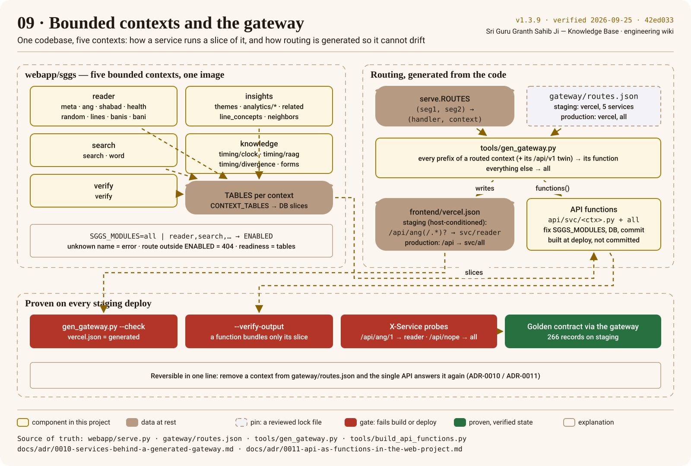

# Bounded contexts and the gateway

The API is one stdlib module tree, `webapp/sggs/`, factored into five **bounded contexts**. Any
of them can run alone as a service from the same image, and the routing that sends each `/api`
prefix to the right place is generated from the code, never written by hand
([ADR-0010](../adr/0010-services-behind-a-generated-gateway.md),
[ADR-0011](../adr/0011-api-as-functions-in-the-web-project.md)).



## The contexts and their routes

| Context | Routes (`/api/…`) | Module |
|---|---|---|
| reader | `meta`, `ang`, `shabad`, `health`, `random`, `lines`, `banis`, `bani` | `sggs/reader.py` |
| search | `search`, `word` | `sggs/search.py` |
| verify | `verify` | `sggs/verification.py` |
| insights | `themes/network`, `analytics/*`, `related`, `line_concepts`, `neighbors` | `sggs/insights.py` |
| knowledge | `timing/clock`, `timing/raag`, `timing/divergence`, `forms` | `sggs/knowledge.py` |

No two contexts share a path prefix, so any route can be sent to exactly one service. Each module
declares the tables it reads (`TABLES`); `CONTEXT_TABLES` in `serve.py` collects them and is the
source for the per-service database slices (`make slices`).

## Running one context

```bash
SGGS_MODULES=search SGGS_DB=build/slices/search.sqlite python3 webapp/serve.py
```

`SGGS_MODULES` is `all` by default (the monolith) or a comma list; an unknown name is an error, a
route outside the enabled set is a 404, and startup refuses a database missing any declared table
(`/readyz` reports `ready`, `contexts`, `missing_tables`, `version`, `commit`).

## Routing, generated

`gateway/routes.json` says per environment where `/api` goes. Staging and — on `integration` —
production both list all five contexts, so each has its own Vercel function (`api/svc/<context>`)
and `all` catches the rest. Production *today* (v1.3.10, released before the split) still answers
every path with `all`; the five contexts go live there together in the first release after the app
is on the App Store (owner decision 2026-09-26, services-production step 3). Setting
`api_platform: render` proxies `/api` back to the Render single API — the rollback. `tools/gen_gateway.py`
combines it with `serve.ROUTES` and writes the rewrites in `frontend/vercel.json`: every prefix of
a routed context and its `/api/v1` twin to its function, everything else to `all` — staging's rules
first, host-conditioned, then production's, host-less. At deploy time `tools/build_api_functions.py` generates the functions themselves;
nothing generated is committed.

## What CI proves

- `gen_gateway.py --check`: the committed rewrites equal what the code generates.
- `build_api_functions.py --verify-output`: each function bundles only its entry, the API code and
  its own database slice.
- `X-Service` probes: each routed context answers its own routes; `/api/nope` falls through to `all`.
- The whole golden contract (266 records) replays through the gateway on the staging site.

Reversal is one line: remove a context from `gateway/routes.json` and `all` answers it again on the
next deploy. Production changes only when the move is released through the normal pipeline, and
that release owes the performance gate —
`tools/perf_baseline.py --compare docs/perf/baseline-2026-09.json` from the same vantage, p95
within +10 % per context — besides the data canary
([runbook](../process/runbooks/services-production.md)).
