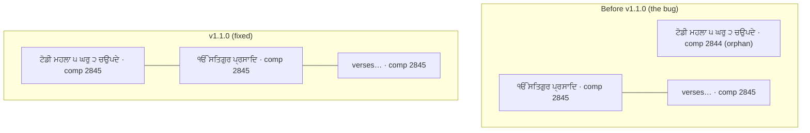

# Database Schema & the `comp_id` Model

`db/sggs.sqlite` (~104 MiB, Git LFS) is opened read-only (`mode=ro&immutable=1`,
`query_only`). 33 real tables + FTS5 shadow tables, in five layers.

## `lines` — the verse table (60,658 rows)
One display line each: `id`, `ang` (1–1430), `pdf_page`, `raag`, `section`,
`author`, `comp_type`, `ghar`, **`comp_id`**, `line_no`, `is_rahao`, `is_header`,
`markers`, `gurmukhi` (verbatim), `text` (clean), `translit`, `translit_norm`
(phonetic fold, DB-built), `fl_g`/`fl_r`, `skeleton`, `stanza_index`, `pada_total`,
`source_category`.

## `comp_id` groups a whole composition — heading run included

A composition (a shabad, salok, pauri, vaar unit) is the set of `lines` sharing a
`comp_id`. **A run of consecutive heading lines opens ONE composition together with
the body it introduces** — a raag/title line, the `ੴ` invocation, and a
`ਸਲੋਕੁ ਮਃ` label all carry the same `comp_id` as the verses they precede.

Before v1.1.0 every heading line got its own `comp_id`, so a title line followed
by a separate `ੴ` invocation became a one-line "orphan" composition that
`/api/shabad/{comp_id}` never fetched — the sheet dropped the printed title. The
fix (`build_corpus.py` post-pass 1b) folds each heading run into the composition it
opens.

### Key invariants (checked by `verify_regroup.py`)
- The run adopts its **last** heading's `comp_id` → **no body line's `comp_id`
  ever changes**, so saved bookmarks, deep links, and analytics keyed on `comp_id`
  stay valid.
- Vacated ids become **permanent gaps**: distinct compositions **4,706**,
  `max(comp_id)` **5,380**. `comp_id` 1 is a gap (Mool Mantar folds into Japji,
  `comp_id` 2). `/api/shabad/{gap}` → 404.
- Every composition's first line is a heading; no heading follows a body line.
- Exactly **3** header-only compositions remain — the closing rubrics `ਜੁਮਲਾ`,
  `ਦੁਤੁਕੇ`, `ਏਹੁ ਸਲੋਕੁ ਆਦਿ ਅੰਤਿ ਪੜਣਾ` (`TRAILING_RUBRICS`), which belong to the
  *preceding* unit and are flagged for scholarly review.

## Layers (grouped)
- **Scripture core:** `lines`, `raags`, `sections`, `authors`, `vaars`, `vaar_units`, `shabd_raag_map`, `shabd_musical_markers`, `shabd_structural_form`, `shabd_poetic_genre`.
- **Search:** `fts`, `fts_en`, `fts_shabad`, `fts_tri`, `variants`, `word_freq`, `canon_tokens`.
- **Translations:** `translations`, `sources`.
- **Analytics:** `concepts`, `concept_lines`, `theme_network`, `theme_fingerprint`, `author_analytics`, `raag_analytics`, `author_distinctive_terms`, `author_resonance`, `line_neighbors`, `shabad_neighbors`.
- **Knowledge / meta:** `raag_timing_claims`, `timing_sources`, `timing_migrations`, `meta`, `analytics_meta`.

## Gotchas
- `comp_type` is known-mislabeled in places; it is suppressed at the display layer. Prefer `comp_id`/`section`.
- Japji (385 lines) has `author = null` in the source, so author filters for Guru Nanak miss it.
- `line_neighbors` is built with a nondeterministic random projection — its row *order* varies across rebuilds (its content is what matters).
