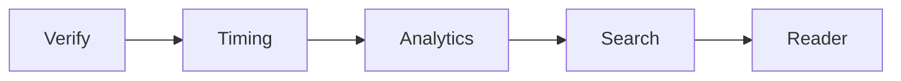

# Microservices Roadmap (monolith → modular → services)

`webapp/serve.py` is a single stdlib module today. The path to services is
**incremental and proven by the golden vectors** — no behaviour changes as seams
are extracted.

## Step 1 — modular monolith (in-repo package `webapp/sggs/`)
Split the single dispatch ladder into modules behind an app-context object:
`db.py` (connection factory, `_int`, `rows_to_list`, degradation convention),
`search/` (waterfall + `romannorm`), `reader.py`, `analytics.py`, `timing.py`,
`verify.py`, `static.py`, `http.py` (router). `serve.py` becomes a thin entrypoint.
Extraction order by coupling (cleanest first):

**Progress.** 2026-09-24 — `api()` is a route table (`serve.ROUTES`): 26 handlers, each tagged with
its bounded context (reader, search, verify, insights, knowledge). Behaviour proven identical
(golden vectors in-process and over HTTP, a differential old-vs-new run, all three harnesses).
2026-09-24 — the handlers and their helpers live in bounded-context modules under `webapp/sggs/`
(`core` · `search` · `reader` · `verification` · `insights` · `knowledge`). `core` owns the one DB handle
and all shared mutable state; context modules reach it as `core.NAME` and never import `serve`.
`serve.py` is the composition root (build identity, route table, HTTP layer) and proxies
`serve.DB = …` to `core`. Behaviour proven identical again (80/80 differential, seeded Hukam,
HTTP contract against `python serve.py`, harnesses).
2026-09-24 — each context declares the tables it reads (`TABLES`; `serve.CONTEXT_TABLES`), enforced by an
authorizer-scoped test over every golden suite and OpenAPI sample. Finding: no API route reads `fts_tri`.

## Step 2 — service split (later)
Each module becomes a service behind a gateway that keeps the **single `/api/*`
origin** (so no CORS is introduced), each with a shared read-only DB image. The
`contract/*.ndjson` vectors become cross-service tests (`pipeline/contract_http.py` replays them
over HTTP against any running API); `contract/openapi.json` (generated by `pipeline/gen_openapi.py`)
is the contract. Verify and Timing extract first (own tables, own graceful-degradation path).

Guardrails: `/api/meta` gains a per-module health block; every response stays
same-origin; golden vectors + `webapp/tests/` prove byte-identical behaviour before
and after each move.
