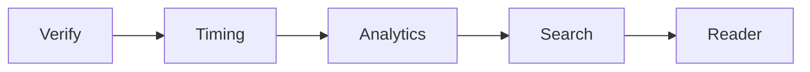

# Microservices Roadmap (monolith → modular → services)

`webapp/serve.py` is a single stdlib module today. The path to services is
**incremental and proven by the golden vectors** — no behaviour changes as seams
are extracted.

## Step 1 — modular monolith (in-repo package `webapp/sggs/`)
Split the single dispatch ladder into modules behind an app-context object:
`db.py` (connection factory, `_int`, `rows_to_list`, degradation convention),
`search/` (waterfall + `romannorm`), `reader.py`, `analytics.py`, `timing.py`,
`verify.py`, `static.py`, `http.py` (router). `serve.py` becomes a thin entrypoint.
Extraction order by coupling (cleanest first):

## Step 2 — service split (later)
Each module becomes a service behind a gateway that keeps the **single `/api/*`
origin** (so no CORS is introduced), each with a shared read-only DB image. The
`contract/*.ndjson` vectors become cross-service tests; `docs/architecture/openapi.yaml`
is the contract. Verify and Timing extract first (own tables, own graceful-degradation path).

Guardrails: `/api/meta` gains a per-module health block; every response stays
same-origin; golden vectors + `webapp/tests/` prove byte-identical behaviour before
and after each move.
