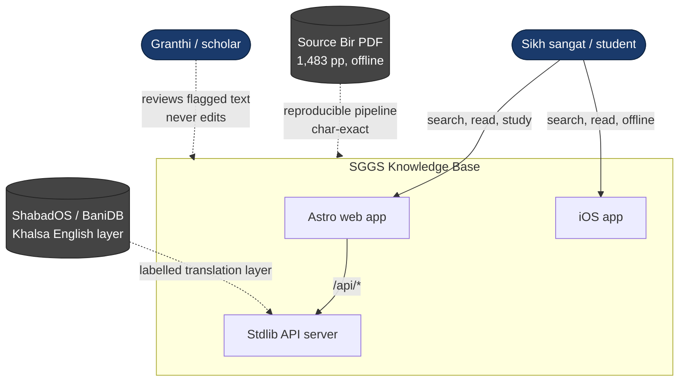
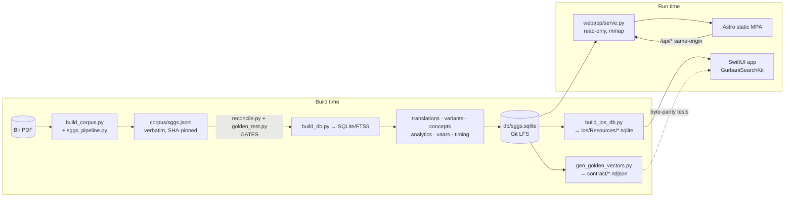
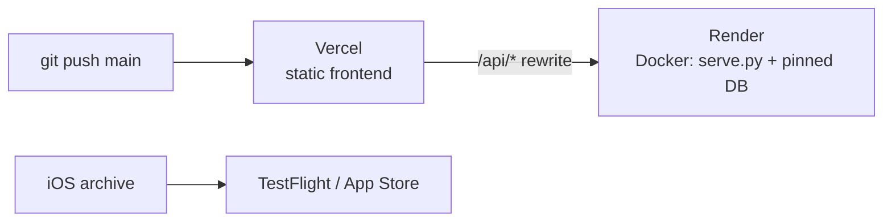

# Architecture Overview

## System context (C4 level 1)

## Containers (C4 level 2)

## Deployment (production)

The web frontend and API are **same-origin**: the browser calls `/api/*` and
Vercel rewrites those paths to the Render service, so there is no CORS and the
frontend carries no API-base configuration. A staging environment mirrors this
with a host-conditioned rewrite — see [Environments](../process/environments.md).

## The five layers
1. **Scripture core** — `lines` (60,658 verbatim rows), raags, sections, authors, vaars.
2. **Search indexes** — FTS5 (`fts`, `fts_en`, `fts_shabad`, `fts_tri`), `variants`, `word_freq`.
3. **Translations** — the Khalsa English layer, a separate labelled table (never blended into Gurmukhi).
4. **Analytics / Insight Engine** — theme network, stylometry, resonance, semantic neighbours.
5. **Knowledge layer** — attributed raag-timing claims (divergence preserved, never adjudicated).

## Source of truth vs generated
- **Source of truth:** the PDF; `validation/concepts_*.json`; `pipeline/timing/timing_seed.json`;
  `pipeline/translations/*.jsonl` (private — fetched from `Algorythmos-AI/sggs-source` by
  `scripts/data/fetch_translations.sh`, verified against `pipeline/translations.SHA256SUMS`); `webapp/serve.py` + `verify.py` + `romannorm.py` (the behaviour the Swift port mirrors); all `frontend/src/` and `ios/App/Sources/`.
- **Generated:** `corpus/sggs.jsonl` (committed, SHA-pinned), `db/sggs.sqlite`, `contract/*.ndjson`, `frontend/dist/`, `webapp/static/` (and, in the app repository, `ios/Resources/*.sqlite`).

See [microservices roadmap](microservices-roadmap.md) for how the monolith is
factored for a later service split.
