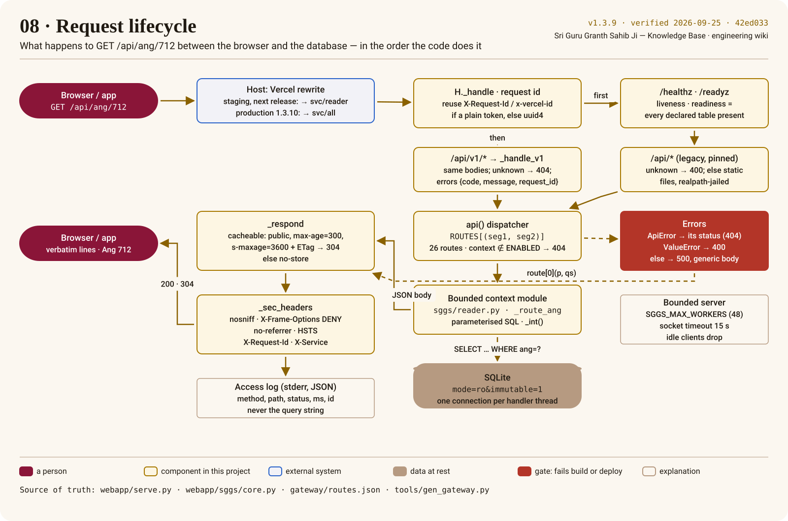

# Request lifecycle

Step through what `webapp/serve.py` does with one request. Everything in the poster is read from
the code named in its footer; the wiki gate keeps the footer honest.



## The order, in prose

1. **Same-origin.** The browser calls `/api/ang/712` on the site's own host. A Vercel rewrite,
   generated from the route table ([bounded contexts](bounded-contexts-and-gateway.md)), forwards
   it to the API. No CORS, no API base URL in the frontend.
2. **Request id, then probes.** `H._handle` records the start time and a request id — an
   incoming `X-Request-Id` or `x-vercel-id` is reused only when it is a plain token — and answers
   `/healthz` (liveness) and `/readyz` (every declared table present) before anything else.
3. **Two API surfaces.** `/api/v1/*` is strict: unknown endpoint → 404; every error is
   `{error: {code, message, request_id}}`. `/api/*` is the legacy surface whose bodies the golden
   contract pins byte for byte. Anything else is a static file from a realpath jail.
4. **Dispatch.** `api()` looks up `(first segment, second segment)` in `ROUTES` — 26 routes, each
   tagged with its bounded context. In split mode a route outside `ENABLED` is a 404.
5. **The context reads SQLite.** The handler runs parameterised SQL on a connection opened
   `mode=ro&immutable=1` with `query_only`; the app can never write to the scripture.
6. **Respond.** Cacheable segments get `public, max-age=300, s-maxage=3600` and a sha256 ETag
   (a repeat becomes a 304); everything else is `no-store`. Every response carries `nosniff`,
   `X-Frame-Options: DENY`, `Referrer-Policy: no-referrer`, HSTS, `X-Request-Id` and `X-Service`.
7. **Log the path only.** One JSON line per request with method, path, status, milliseconds and
   the id. The query string is never written ([ADR-0009](../adr/0009-production-verification.md)).
8. **Errors and limits.** `ApiError` keeps its status; a bad parameter is a 400 with a short
   message; anything unexpected is a generic 500 with the detail on the server log only. Handler
   threads are capped (`SGGS_MAX_WORKERS`) and idle sockets time out after 15 s.

## Try it

With `serve.py` running locally:

```bash
curl -si 'http://localhost:7777/api/ang/712' | sed -n '1,12p'
```

Look for `X-Request-Id`, `X-Service: all`, `Cache-Control: public, max-age=300, s-maxage=3600`
and the `ETag`. Send the ETag back in `If-None-Match` and the answer is a 304.

Related: [Engineering invariants](../engineering/invariants.md) · the API reference on this site (generated from `contract/openapi.json`)
