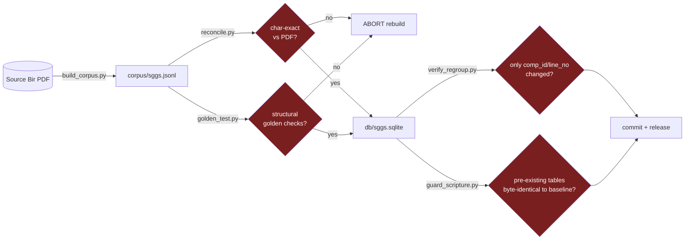

# Scripture Integrity

Textual fidelity is the single most important property of this project and
overrides everything else. The Gurmukhi text is **verbatim** from the source Bir
and is **never** edited, paraphrased, normalized, reordered, or guessed at.

## The guarantee chain

## The only sanctioned text transforms
1. PDF **visual → logical** Unicode reordering of the sihari (`ਿਕ੍ਰਪਾ → ਕ੍ਰਿਪਾ`).
2. **3 logged** editorial Unicode-repair corrections (Angs 573, 586, 727) where the
   source font emitted impossible sequences.

Any new transform must be logged the same way and reviewed by a human. The English
translations are a **separate, labelled layer** (Dr. Sant Singh Khalsa via
BaniDB/ShabadOS) and are never blended into the Gurmukhi.

## Proof tools
| Tool | Proves | When |
|---|---|---|
| `pipeline/reconcile.py` | corpus == PDF, character for character | every rebuild (gate) |
| `pipeline/golden_test.py` | canonical structural checks | every rebuild (gate) |
| `pipeline/verify_regroup.py` | a corpus change touched only `comp_id`/`line_no`; scripture byte-identical | any PR touching corpus/db |
| `pipeline/timing/guard_scripture.py` | pre-existing tables byte-identical to the committed baseline | after any DB write |
| `validation/reconcile-attestation.json` | the corpus in this commit reconciled char-exact locally (the PDF never enters CI) | `make reconcile` |
| `/api/health` | 60,658 lines, 1,430 Angs, FTS live, verbatim Mool Mantar, ≥560 ੴ, live verify | after any DB change |

## The hash chain
`MANIFEST.json` carries `corpus_sha256` + `db_sha256`; `contract/_meta.json` carries
its own `db_sha256`; the iOS manifest carries `db_sha256` + `scripture_sha256`.
`scripture-integrity` CI asserts these agree, so a DB rebuild that forgets to
regenerate the contract or the attestation fails the gate rather than silently
shipping drift.

## If text looks wrong
**Flag it, do not change it.** Open a *Scripture fidelity concern* issue with the
Ang and the verbatim line; a Granthi/scholar reviews. Known items awaiting review:
the 3 `TRAILING_RUBRICS` (`ਜੁਮਲਾ`, `ਦੁਤੁਕੇ`, `ਏਹੁ ਸਲੋਕੁ ਆਦਿ ਅੰਤਿ ਪੜਣਾ`), ~20
verse lines the source mis-tags as headings, and the source-faithful isolated-matra
rows (Angs ~695–699, 1354/1358/1387).
