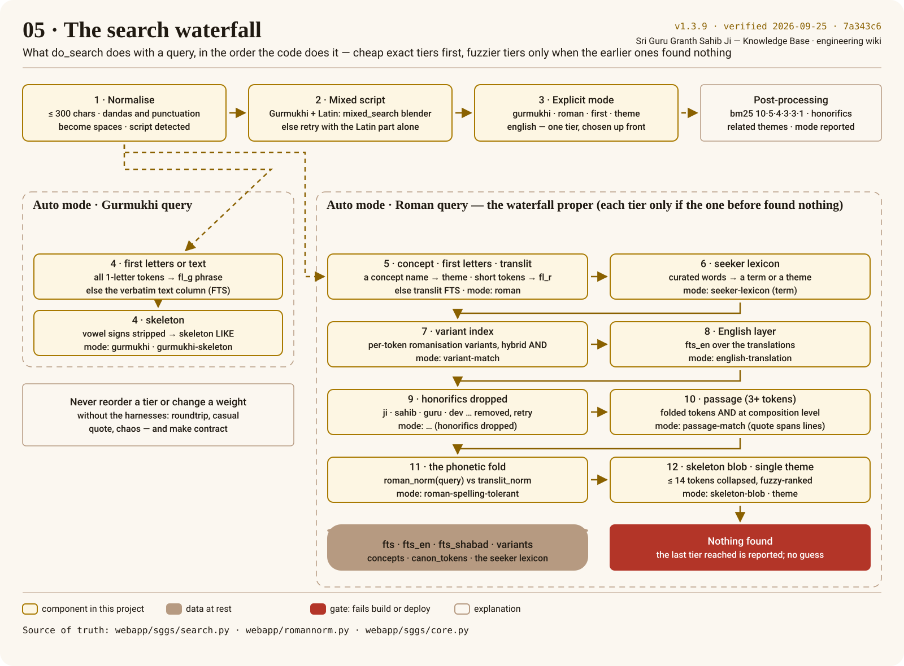

# Search waterfall

`/api/search?q=&mode=` runs a deliberate **waterfall**: cheap exact tiers first, progressively
fuzzier tiers only when the earlier ones found nothing, results bm25-ranked with weighted columns.
The poster shows the cascade as `do_search` codes it; the simulator below runs a real query and
lights the tier that answered. The tiers in detail, the fold, the verification engine and the
harnesses are in [Search & verification](../search/README.md).



## Try it

<!-- sggs:waterfall q="sat nam" -->
On the rendered wiki this is a simulator: type a query, pick a mode, and the `mode` the API reports
names the tier that answered while the matching step of the poster lights up; results are shown
verbatim with their [[Ang]]. On GitHub, try the same queries on [gurbanisoul.com](https://gurbanisoul.com).

## The tiers, in code order

Every `mode` string below is a literal in `webapp/sggs/search.py`; `tools/docs_check.py` fails the
build if the code gains a tier this page does not name.

| # | Runs when | What it queries | `mode` reported |
|---|---|---|---|
| 1 | always | length ≤ 300; dandas and punctuation → spaces; script detected | — |
| 2 | auto · Gurmukhi **and** Latin present | `mixed_search` (one AND over text, variants, lexicon, fold); else the Latin tokens alone, re-run | `mixed-script`, `mixed-script (latin part: …)` |
| 3 | an explicit `mode` | `gurmukhi` → text FTS then skeleton; `roman` → translit then the fold; `first` → `fl_g`/`fl_r` phrase; `theme` → concept index; `english` → `fts_en` | `gurmukhi`, `gurmukhi-skeleton`, `roman`, `roman-spelling-tolerant`, `first-letters`, `theme`, `english` |
| 4 | auto · Gurmukhi | all single-letter tokens → `fl_g` phrase; else text FTS; else vowel signs stripped → `skeleton LIKE` | `first-letters`, `gurmukhi`, `gurmukhi-skeleton` |
| 5 | auto · Roman | exactly a concept name → theme; ≥ 2 tokens of ≤ 3 letters → `fl_r` phrase (then translit); else translit FTS | `theme`, `first-letters`, `roman` |
| 6 | nothing yet | the seeker lexicon: curated words → a transliteration term or a theme | `seeker-lexicon (term)` |
| 7 | nothing yet | the precomputed romanisation-variant index, hybrid per-token resolution | `variant-match` |
| 8 | nothing yet | the English layer, `fts_en` — before the fold, so "mercy" reaches translations | `english-translation` |
| 9 | nothing yet, honorifics present | drop `ji`, `sahib`, `maharaj`, `guru`, `dev`, `baba`, … and re-run the waterfall | `… (honorifics dropped)` |
| 10 | nothing yet, ≥ 3 tokens | folded tokens AND at composition level in `fts_shabad`; the composition's lines in order | `passage-match (quote spans lines)` |
| 11 | nothing yet | the phonetic fold: `roman_norm(query)` against `translit_norm`, tokens ≥ 2 chars, headings excluded | `roman-spelling-tolerant` |
| 12 | nothing yet, ≤ 14 tokens | `blob_search`: the query collapsed to a fold-skeleton blob, prefiltered and fuzzy-ranked; a single token is tried as a theme | `skeleton-blob`, `theme` |
| — | after any tier, auto, < 3 results | the honorific-dropped retry tops up the list | `… + honorific-dropped` |

Then, whatever tier answered: `bm25` ranking with column weights **10 · 5 · 4 · 3 · 3 · 1** over
`text`, `translit`, `translit_norm`, `fl_g`, `fl_r`, `skeleton`; translations attached to every
result; related themes for a [[Gurmukhi]] query. Nothing is guessed: when every tier is exhausted the
list is empty and the last tier reached is the `mode`.

<!-- sggs:code file="webapp/sggs/search.py" symbol="do_search" -->
Source: [`webapp/sggs/search.py` · `do_search`](../../webapp/sggs/search.py) — the excerpt is read from the file at build time.

## The Roman fold — the highest-risk invariant

`roman_norm` folds spelling variants (`waheguru`, `vaahiguroo` → `vhgr`). It exists in **three**
places that must stay byte-identical: `webapp/romannorm.py` here (query time; re-exported by
`serve.py`, imported by `verify.py`), `pipeline/sggs_pipeline.py:roman_norm` in sggs-data (built
the `translit_norm` column) and `RomanNorm.swift` in the iOS app. `contract/golden_roman_norm.ndjson`
(24,719 vectors) pins all three. The whole story is [The Roman fold](../search/the-roman-fold.md).

## Verifying a search change

```bash
python3 tools/roundtrip_harness.py
python3 tools/casual_quote_harness.py
python3 tools/chaos_harness.py "qa/chaos/attacks_*.jsonl" qa/results/chaos.jsonl   # needs a running server
make contract                          # golden vectors must not drift unexpectedly
```

Do not reorder tiers or change weights without re-running these: small changes shift ranking
corpus-wide. What each harness measures is on [Harnesses and golden vectors](../search/harnesses-and-golden-vectors.md).
