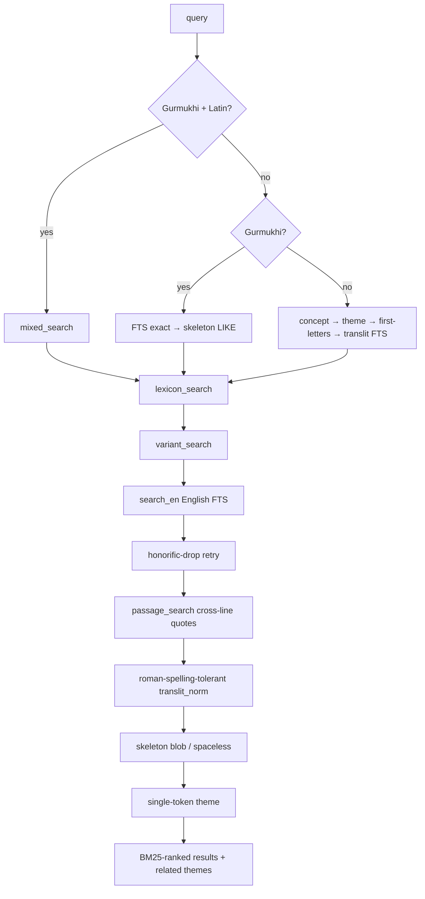

# Search Waterfall

`/api/search?q=&mode=` runs a deliberate **waterfall**: cheap exact matches first,
progressively fuzzier tiers after, BM25-ranked with weighted columns. Do not
reorder tiers or change weights without re-running the harnesses — small changes
shift ranking corpus-wide.



## The Roman fold — the highest-risk invariant
`roman_norm` folds spelling variants (`waheguru`, `vaahiguroo` → `vhgr`). It exists
in **three** places that must stay byte-identical:
- `webapp/romannorm.py` (query time; re-exported by `serve.py`, imported by `verify.py`),
- `pipeline/sggs_pipeline.py:roman_norm` (built the `lines.translit_norm` column),
- `ios/Packages/GurbaniSearchKit/Sources/GurbaniSearchKit/RomanNorm.swift` (the port).

If the query-time fold ever diverges from the indexed fold, search silently breaks.
`contract/golden_roman_norm.ndjson` (24,719 vectors) pins all three.

## Verifying a search change
```bash
python3 pipeline/roundtrip_harness.py
python3 pipeline/casual_quote_harness.py
python3 pipeline/chaos_harness.py     # needs a running server
make contract                          # golden vectors must not drift unexpectedly
```
