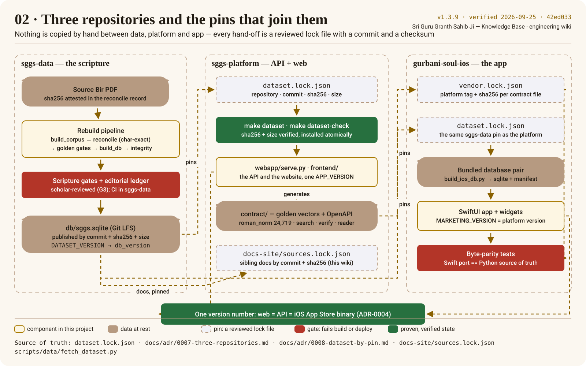

# Three repositories and pins

The project is three repositories joined by pins — small, reviewed files naming an exact commit
and the sha256 of the artifact taken from it — so nothing is copied by hand and nothing can drift.
The newcomer's version of this page is [How the repositories fit together](../onboarding/how-the-repos-fit.md);
the decisions are [ADR-0007](../adr/0007-three-repositories.md) and [ADR-0008](../adr/0008-dataset-by-pin.md).

## The four pins

| Pin | Where | Names | Proved by |
|---|---|---|---|
| `dataset.lock.json` | platform | sggs-data commit · `db/sggs.sqlite` sha256 · size | `make dataset-check` (`scripts/data/fetch_dataset.py --check-pin`), `scripture-integrity` |
| `dataset.lock.json` | app | the same object | the app's CI |
| `vendor.lock.json` | app | platform tag `vX.Y.Z` · sha256 per vendored `contract/` file | the app's parity tests and release gate |
| `docs-site/sources.lock.json` | platform (wiki) | sibling commit · sha256 per published doc | `tools/fetch_sibling_docs.py --check` in the `docs` job |

A bump of any of them is a small pull request that a reviewer can read in full.
