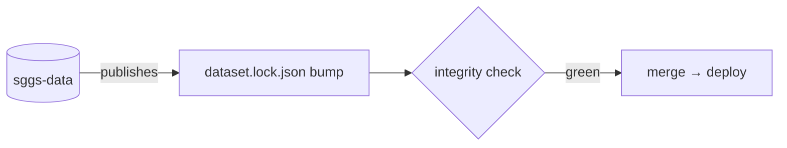

# Adding a diagram

A Mermaid fence renders on GitHub with GitHub's theme and on the site as accessible inline SVG in
the brand palette, at build time — no runtime JavaScript, indexed by search, readable by a screen
reader.

## The rules

- Start every diagram with `accTitle:` (a name) and `accDescr:` (one sentence). The gate warns on
  a missing title.
- Colours, if you set any, come from `docs/brand/tokens.json`; no `%%{init}` directives — the
  theme is central. Brand red never appears in a diagram.
- Labels are plain text (`htmlLabels` is off): use ` ` for a line break, nothing else.
- No scripture in a diagram, ever.
- Keep it under about twelve nodes. Past that, write a [poster](adding-a-poster.md): it steps, it
  zooms, and it carries a verified stamp.

## Example

## Checking it

`make docs-check` checks the palette and the title; `make docs` renders every fence and fails the
build if one does not render (the `check-mermaid` step confirms none was left as a code block).
