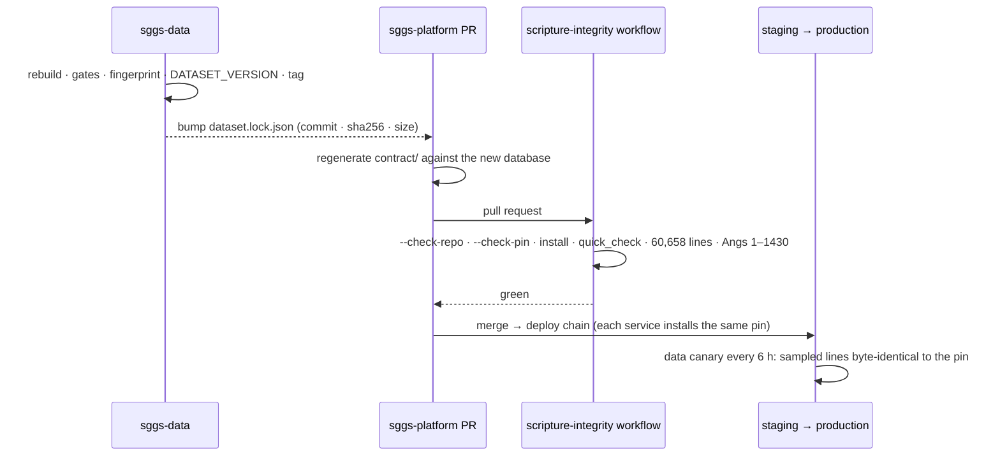

# The dataset pin

The database is never committed to this repository and never copied by hand. `dataset.lock.json`
names the object; `scripts/data/fetch_dataset.py` is the only way it arrives — in CI, in the API
image build and locally — streamed from sggs-data's Git LFS, verified against the lock, installed
atomically. What production serves is exactly what sggs-data proved, byte for byte
([ADR-0008](../adr/0008-dataset-by-pin.md)).

## The lock

<!-- sggs:code file="dataset.lock.json" lines="1-10" -->
Source: [`dataset.lock.json`](../../dataset.lock.json) at the root of this repository.

`commit` is the sggs-data commit that published the database; `sha256` and `size` identify the
object itself. Git LFS object ids *are* content sha256s, so this is the same identity the data
repository records, and a lock can never point at an object sggs-data did not publish.

## What the fetcher guarantees

<!-- sggs:code file="scripts/data/fetch_dataset.py" symbol="_stream_verified" -->
Source: [`scripts/data/fetch_dataset.py`](../../scripts/data/fetch_dataset.py), `_stream_verified`.

- The bytes written equal the lock's sha256 and size, or nothing is installed.
- The destination is replaced atomically (same-directory temp file, fsync, `os.replace`): a failed
  or interrupted fetch never leaves a truncated database behind.
- `--check-pin` reads the LFS pointer committed at the pinned sggs-data commit and requires it to
  name the same oid and size.
- `--check-repo` requires `contract/_meta.json` — the golden contract's own record of the database
  it was generated from — to name the same sha256, so a contract regenerated against a different
  database cannot ship silently.
- A token (`GH_TOKEN`) is sent when present; that is what a private sggs-data needs.

```bash
make dataset          # install db/sggs.sqlite from the pin (cached by hash in .dataset-cache)
make dataset-check    # the pin agrees with contract/_meta.json, and sggs-data@commit publishes it
```

## How a new dataset arrives



1. sggs-data rebuilds, passes its gates, writes the fingerprint and `DATASET_VERSION`, and
   publishes the database by commit.
2. A pull request here changes **one file**, `dataset.lock.json`, and regenerates the golden
   contract (`make contract`) so `contract/_meta.json` names the new object.
3. The `scripture-integrity` workflow proves the pin and the contract agree, that sggs-data
   publishes the object at that commit, that the installed database opens, passes SQLite's
   integrity check and holds 60,658 lines over Angs 1–1430.
4. After merge, every deploy installs the same pin; the data canary samples lines from production
   every six hours and compares them byte for byte with the pinned database.

A revert is a lock revert: every pinned object stays available in sggs-data, so rolling back the
data is the same small pull request in the other direction.

## The iOS app uses the same pin

`gurbani-soul-ios` carries its own copy of `dataset.lock.json` pointing at the same sggs-data
commit, builds its bundled database pair from it (`build_ios_db.py`) and proves the database hash
inside the archived app. Web, API and app therefore serve one dataset — see
[three repositories and pins](../architecture/three-repositories-and-pins.md).
