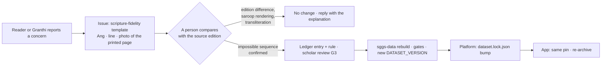

# The editorial ledger

The [[Gurmukhi]] in the corpus is verbatim from the source Bir. The pipeline transforms the PDF's
*glyph stream* into *logical Unicode* — and that is all it does. Every transform it applies is an
entry in one register, `audit/editorial-ledger.jsonl` in sggs-data, and a CI gate there fails any
scripture change or any new rule that has no entry. This page explains the register; the register
itself is the [canonical file](https://github.com/Algorythmos-AI/sggs-data/blob/main/audit/editorial-ledger.jsonl).

> **Explanation, not scripture.** This page describes rules by their codepoint classes and never
> reproduces a verse. When you need the text, read it verbatim with its Ang from the
> [Ang explorer](line-record.md#explore-real-records) or the website.

## Two kinds of transform, one register

| Class | What it is | Entries | Where in code |
|---|---|---|---|
| **Decoding** (D0–D6) | Undoing what the PDF font did to the byte order: print-job timestamps stripped; a consonant and its halant swapped back into logical order; font glyphs restored to the signs they printed (kanna with bindi, subjoined haha and vava, bindi, hora); `ੴ` restored from its two-glyph form; a vowel sign re-attached where a stray space split it (the archaic `ਓੁ` spellings, 12 cases); the sihari moved after its consonant cluster; stray private-use and Latin characters stripped and the text NFC-normalised | 7 rules | `fix_text` steps 0, 1, 2, 2b, 3, 5 |
| **Editorial** (R1–R4) | Repairing an *impossible* Unicode sequence the font emitted — a doubled sihari, a halant before the consonant it belongs to, a detached sihari with a dotted circle, Sahaskriti clusters with a leading sihari — restored to the canonical reading | 4 rules, **11 applications** | `fix_text` step 4 |
| **Flags** (F1–F2) | Things the pipeline *notices but does not change*: an orphan sihari with no following consonant (11 occurrences), and the rare Sahaskriti ligature glyph decoded to kanna (4, logged for review) | 2 flags | logged, never transformed |

The eleven applications, one per affected line:

| Entry | Rule | Ang | Review |
|---|---|---|---|
| E001 · E002 | R1 | 573 · 586 | documented from the start |
| E003 | R3 | 727 | documented from the start |
| E004 | R2 | 1354 | approved 2026-09-24 (gate G3) |
| E005 · E006 | R4 | 1358 · 1387 | approved 2026-09-24 (gate G3) |
| E007 – E011 | R1 | 1398 · 1402 · 1406 · 1408 · 1409 | approved 2026-09-24 (gate G3) |

The three earliest applications were itemised when the pipeline was written; the other eight were
applied by the same rules and itemised on 2026-09-23, then reviewed and approved by a scholar on
2026-09-24. **If a page or a comment still says "3 logged corrections", it is out of date:** the
register is 4 rules and 11 applications.

## The gate

`ledger_check.py` runs on every pull request in sggs-data, and fails it unless all three hold:

<!-- sggs:code file="pipeline/ledger_check.py" lines="2-19" repo="sggs-data" -->
Source: [`pipeline/ledger_check.py`](https://github.com/Algorythmos-AI/sggs-data/blob/main/pipeline/ledger_check.py) in sggs-data.

So a rule cannot be added to the code without the register, a register entry cannot claim a rule
the code does not have, and a line's text (`ang`, `gurmukhi`, `text`, `markers` — the "T0" fields)
cannot change between two commits unless a new application entry names that line.

## How a fidelity concern travels

Most reports are an edition difference, the traditional-saroop rendering (a display choice, the
stored text is verbatim) or transliteration (a reading aid, not scripture). Only a confirmed,
reviewed repair is ever registered, and it reaches the site and the app as a new dataset — never
as an edit here. The support side of this flow is in the
[support inbox runbook](../process/runbooks/support-inbox.md); the reverence rules for engineers
are in the [reverence checklist](../onboarding/reverence-checklist.md).

## Still under review

Known items that are *source-faithful* and deliberately unchanged, tracked row by row so they can
never be silently altered (sggs-data's `audit/data-quality-baseline.json`):

- 21 lines with a vowel sign that has no base consonant (Angs 214, 342, 695, 698, 699, 897, 1203,
  1205) — flagged for scholarly review;
- the three closing rubrics that stay one-line compositions (`TRAILING_RUBRICS`);
- roughly twenty verses the source typography sets like headings;
- one line with an empty `translit_norm` (id 35328, [[Ang]] 829), which a rebuild corrects.

None of these is a text edit; each is a review question, and the answer arrives as a ledger entry
or as "leave it as printed".
