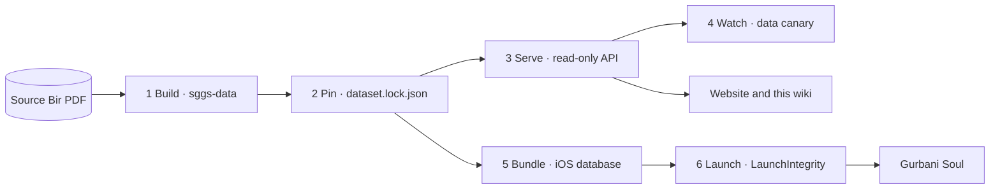

# The integrity chain, for engineers

"The [[Gurmukhi]] text is verbatim" is a promise. This page is its proof, end to end: one line of
scripture travels from the source PDF to a reader's screen through six stages, and at every stage
a gate checks that the bytes are still the bytes the PDF printed. Every gate **fails closed**: when
it cannot prove the text, nothing ships, nothing is served, or the app refuses to show scripture.

## 1. Build — sggs-data proves the corpus against the PDF

The corpus is extracted from the PDF and checked **character for character** against it
(`pipeline/reconcile.py`); the attestation `validation/reconcile-attestation.json` records the PDF's
sha256, because the PDF itself never enters CI. `golden_test.py` checks the structure, the
[editorial ledger](editorial-ledger.md) registers every sanctioned transform (a change to the text
without a reviewed ledger entry fails `ledger_check.py`), and `sggs_integrity.py` fingerprints every
table so a rebuild that changes anything it should not is caught. The full list of build gates is
sggs-data's [scripture integrity](https://github.com/Algorythmos-AI/sggs-data/blob/main/docs/architecture/scripture-integrity.md)
page; how the pipeline runs is [the corpus pipeline and gates](pipeline.md).

**Fails closed:** a rebuild that does not reconcile never produces a database.

## 2. Pin — the platform takes exactly the object sggs-data published

`dataset.lock.json` names the sggs-data commit and the database's sha256 and size. `make dataset`
installs the database only if the downloaded bytes hash to the lock (atomically — an interrupted
download leaves nothing behind); `--check-pin` proves the pinned sggs-data commit publishes that very
object, and `--check-repo` proves `contract/_meta.json` — the golden contract's record of the database
it was generated from — names the same sha256. Details: [the dataset pin](dataset-pin.md).

The required `integrity` check runs all of that on every pull request and push, then opens the
installed database and checks `PRAGMA quick_check`, 60,658 lines, and 1,430 contiguous Angs
(`.github/workflows/scripture-integrity.yml`).

**Fails closed:** a pin that does not match what sggs-data publishes cannot merge.

## 3. Serve — a read-only API that proves itself

The API opens the database `mode=ro&immutable=1` with `PRAGMA query_only=ON`
(`webapp/sggs/core.py`) — the application can never write to scripture. `/api/health` is its self-test, and it is what the status strip on this wiki's
home page reads:

| Check | Proves |
|---|---|
| `lines_60658` | exactly 60,658 display lines |
| `angs_1430` | exactly 1,430 distinct Angs |
| `fts5` | full-text search is built and finds a known word |
| `mool_mantar` | the first line of Ang 1 begins with the Mool Mantar, byte for byte |
| `ik_onkar_568` | full-text search finds the invocation in at least 560 lines |
| `verify_engine` | a known line of Ang 1 verifies as `VERIFIED_EXACT` |
| `banis_ok` | the Nitnem registry's Japji is exactly lines 1–385, in order, and its extra lines carry no English |

Every deploy replays the **golden contract** (`contract/golden_*.ndjson`, `tools/contract_http.py`):
production through the new deployment **before** it is promoted, staging after each deploy — so a
response that changed by one byte blocks the release ([contract and OpenAPI](../api/contract-and-openapi.md)).

**Fails closed:** a deployment that fails its smoke or its contract is never promoted.

## 4. Watch — production is re-proven every six hours

Between releases nothing is assumed. The data canary samples production and compares it, byte for
byte, with the pinned database:

<!-- sggs:code file="tools/data_canary.py" lines="1-19" -->
Source: [`tools/data_canary.py`](../../tools/data_canary.py) — its docstring states exactly what is compared.

`.github/workflows/data-canary.yml` runs it every six hours against the API origin **and** through the
public site (so a stale CDN copy is caught too), with 500 random lines and 12 random Angs plus Angs 1,
712 and 1430, then replays the golden contract over HTTP. A difference opens an issue with the seed,
so the exact failure can be replayed.

**Fails closed:** scripture is never "close enough" — one differing byte is a failure.

## 5. Bundle — the app carries the same bytes, certified

The iOS app is built from the same pinned `db/sggs.sqlite`. Its builder writes a manifest beside the
bundled database with the database's `db_sha256` and a `scripture_sha256` over the scripture columns;
the archive gate refuses a build whose scripture checksum differs from the certified corpus, and
proves the manifest inside the finished `.app`. Details:
[database pair and launch integrity](../ios/db-pair-and-launch-integrity.md).

**Fails closed:** an archive whose database does not hash to its manifest is never uploaded.

## 6. Launch — the phone checks before it shows a line

Before any scripture is shown, `LaunchIntegrity` checks the bundled database against the manifest:
a full streaming hash on the first launch and after any change to the install (a fresh install, an
update, a new manifest), and cheap structural checks while its stored fingerprint still matches. If
anything fails, the app refuses to present scripture and shows the report under More → About →
Integrity.

**Fails closed:** a corrupted install shows no scripture at all, never wrong scripture.

## What this chain does not do

- It never **corrects** text. A line that looks wrong is flagged for a Granthi or scholar
  ([the reverence checklist](../onboarding/reverence-checklist.md)); it is not changed.
- Display choices — the Sant Lipi font, the traditional-saroop rendering on the website — are applied
  to what is drawn on screen only. The stored text, the API, search and copy stay verbatim.
- The English translation is a separate, labelled layer, never blended into the Gurmukhi. The app's
  scripture checksum (`scripture_sha256`) covers the scripture rows alone, and the App Store build
  ships the Gurmukhi-only profile.
