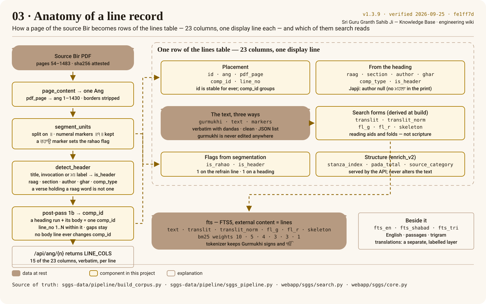

# Anatomy of a line record

Every unit the source prints between two double dandas becomes **one row** of the `lines` table.
The poster follows one page from the PDF to that row; the explorer below it shows real rows,
verbatim, straight from the API.

## Explore real records

<!-- sggs:ang-explorer ang="1" -->
On the rendered wiki this is a live explorer: choose an [[Ang]] and every line record of it is listed,
verbatim from `/api/ang/{n}`, with the placement and heading columns beside it and a definition of
each column on hover. On GitHub, open [Ang 1 on the website](https://gurbanisoul.com/ang/1) instead.

Try the quick picks. Ang 1 opens with a heading and then Japji, whose author is `null` because the
print has no ਮਹਲਾ line. Ang 151 shows a raag title and its invocation sharing one heading run. Ang
462 is where Asa Ki Vaar begins, saloks and pauris interleaving. Ang 712's first composition
began on Ang 711 (`continued_from`). Ang 1256 prints one refrain twice — a legitimate repeat that
the pipeline must never de-duplicate.

## The 23 columns

The table is created by `build_db.py` in sggs-data; the platform reads it read-only.

| Group | Column | Meaning |
|---|---|---|
| Placement | `id` | The row's identity across the corpus (1–60,658); never reused. |
| | `ang` | The Ang, 1–1430. |
| | `pdf_page` | The page of the source PDF (54–1483) the line was read from. |
| | `comp_id` | Groups every line of one composition, heading run included; vacated ids are permanent gaps. |
| | `line_no` | Position inside the composition, 1..N, contiguous. |
| From the heading | `raag` | The musical mode; `null` after Ang 1353, where the Granth leaves the raag framework. |
| | `section` | The bani or section, header-detected. |
| | `author` | From the ਮਹਲਾ or Bhagat label; `null` where the print has none (all of Japji). |
| | `ghar` | The musical "house" (`ਘਰੁ`) of the composition. |
| | `comp_type` | The form word on the heading; known to be mislabelled in places, suppressed at the display layer — prefer `comp_id` and `section`. |
| | `is_header` | 1 on a heading line: a title, the ੴ invocation, a `ਮਃ` label. |
| Flags | `is_rahao` | 1 on the refrain line, from its `ਰਹਾਉ` marker. |
| | `markers` | The numerals that closed the unit, as a JSON list (for example `["੧"]`). |
| The text | `gurmukhi` | The line as printed, verbatim, dandas and markers included. **Never edited anywhere.** |
| | `text` | The same line without its markers, for indexing. |
| Search forms | `translit` | Roman transliteration — a reading aid, not scripture. |
| | `translit_norm` | The spelling-tolerant fold of `translit` (`roman_norm`), built in the database, not in the corpus file. |
| | `fl_g` / `fl_r` | First letters of each word, Gurmukhi and Roman, for first-letter search. |
| | `skeleton` | The line with its vowel signs stripped, for the typo tier. |
| Structure (v2) | `stanza_index` | Which stanza of its composition the line belongs to. |
| | `pada_total` | How many padas the composition has. |
| | `source_category` | A coarse category of the source unit (for layout). |

The API's `LINE_COLS` returns 15 of them on every line (`/api/ang`, `/api/shabad`, search
results), always including `gurmukhi`:

<!-- sggs:code file="webapp/sggs/core.py" symbol="LINE_COLS" -->
Source: [`webapp/sggs/core.py`](../../webapp/sggs/core.py), the `LINE_COLS` tuple.

## Headings, compositions and the `comp_id` rule

A heading is detected by `detect_header` from the unit's text — a raag title, the invocation, a
`ਮਹਲਾ` or Bhagat label — and the lines that follow inherit its metadata. **A run of consecutive
heading lines opens one composition together with the body that follows** (post-pass 1b in
`build_corpus.py`), so `/api/shabad/{comp_id}` returns the printed title. The run adopts its
*last* heading's id, so no body line ever changes `comp_id` and vacated ids become permanent gaps:
4,527 distinct compositions and `max(comp_id)` 5,376 in the pinned dataset, `comp_id` 1 a gap because the Mool Mantar folds
into Japji (`comp_id` 2). The full model, the before/after diagram and the invariants are in the
canonical [database schema](https://github.com/Algorythmos-AI/sggs-data/blob/main/docs/architecture/database-schema.md).

Three closing rubrics (`TRAILING_RUBRICS`) belong to the *preceding* unit and stay one-line
compositions, flagged for scholarly review; a verse that merely contains a raag or form word is
**not** a heading (the v1.1.4 weak-signal rule, which demoted 233 mis-flagged verses).

## What search reads

`fts` is an [[FTS5]] table with external content over `lines`, covering `text`, `translit`,
`translit_norm`, `fl_g`, `fl_r` and `skeleton`, tokenised so [[Gurmukhi]] signs and `ੴ` stay inside
tokens. `do_search` ranks with `bm25` and column weights **10 · 5 · 4 · 3 · 3 · 1** in that order: a
hit in the verbatim text outranks a transliteration hit, which outranks a first-letter or skeleton
hit. Beside it, `fts_en` serves the English tier, `fts_shabad` cross-line passages and `fts_tri`
the trigram typo tier. How the tiers cascade is the [search waterfall](../architecture/search-waterfall.md).

The English translations (Dr. Sant Singh Khalsa via ShabadOS) are a **separate table**, attached to
a line as `en` by the API and labelled as a translation everywhere; they are never blended into the
Gurmukhi.

Read next: [Corpus pipeline and gates](pipeline.md).
