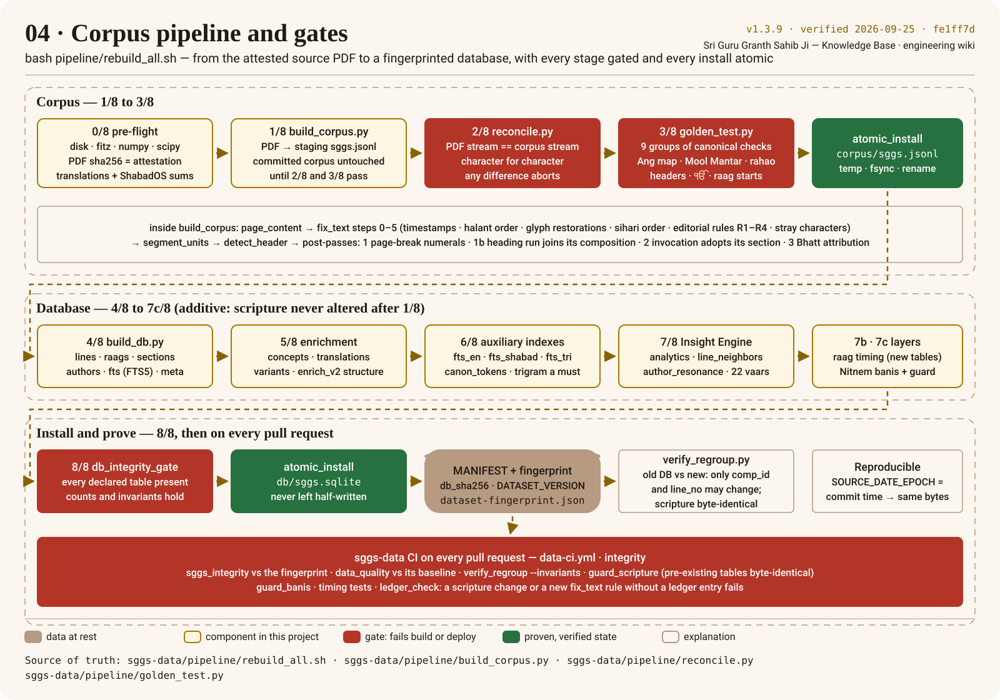

# Corpus pipeline and gates

The rebuild lives in the data repository and is one command: `bash pipeline/rebuild_all.sh`.
Every stage gates on its verifier and every install is atomic, so the committed corpus and
database are replaced only after their checks pass and are never left half-written. The poster
walks the stages in the order the script runs them; the excerpts below are read from sggs-data at
the commit this wiki pins, never pasted.

## The stages

| Stage | Script | What it does | What stops it |
|---|---|---|---|
| 0/8 pre-flight | `rebuild_all.sh` | free disk, PyMuPDF + numpy + scipy, the source PDF's sha256 equals the attestation, translation and ShabadOS inputs match their checksum lists, `SOURCE_DATE_EPOCH` = commit time | any mismatch; a new PDF edition needs `SGGS_ALLOW_NEW_PDF=1` and review |
| 1/8 extract | `build_corpus.py` | page → Ang, `fix_text` steps 0–5, unit segmentation, header detection, four post-passes, written to a **staging** file | — (the committed corpus is untouched) |
| 2/8 reconcile | `reconcile.py` | the PDF's text stream and the corpus stream, spaces dropped, must be identical | one character of difference |
| 3/8 golden suite | `golden_test.py` | nine groups of canonical checks | any failed check |
| install corpus | `atomic_install.py` | temp file beside the target, fsync, rename | sha mismatch |
| 4/8 database | `build_db.py` | `lines` (23 columns), indexes, `raags`/`sections`/`authors`, `fts` (FTS5), `meta` | — |
| 5/8 enrichment | `load_translations.py`, `build_variants.py`, `enrich_orchestrator.py`, `enrich_v2.py` | concepts, translations as their own table, phonetic variants, structural columns | — |
| 6/8 auxiliary indexes | inline SQL | `fts_en`, `fts_shabad`, `fts_tri`, `canon_tokens` | an SQLite without the trigram tokenizer (a search-tier contract) |
| 7/8 Insight Engine | `ml_analytics_builder.py`, `build_semantic_vectors_lite.py`, `build_resonance.py`, `build_vaars.py` | analytics, semantic neighbours, resonance, the 22 Vaars — additive tables | — |
| 7b · 7c layers | `pipeline/timing/*`, `pipeline/banis/*` | raag-timing knowledge layer, Nitnem bani registry; `guard_banis.py` | the bani guard |
| 8/8 gate + install | `db_integrity_gate.py`, `atomic_install.py`, `sggs_integrity.py` | every declared table present and counted; atomic install; `MANIFEST.json`; `audit/dataset-fingerprint.json` | the integrity gate |

## Extraction, read from the source

`fix_text` is the only place the printed glyph stream is transformed into logical Unicode. Steps
0 to 3 and 5 are decoding rules (timestamps, halant order, glyph restorations, sihari order, stray
characters); step 4 is the four registered editorial rules. Every rule is an entry in the
[editorial ledger](editorial-ledger.md), and `ledger_check.py` fails a pull request whose code
and ledger disagree.

<!-- sggs:code file="pipeline/sggs_pipeline.py" symbol="fix_text" repo="sggs-data" -->
Source: [`pipeline/sggs_pipeline.py` · `fix_text`](https://github.com/Algorythmos-AI/sggs-data/blob/main/pipeline/sggs_pipeline.py) in sggs-data.

`segment_units` cuts the page stream on the double danda, keeps the numeral markers with the unit
they close and sets the rahao flag; `detect_header` then reads the metadata from a heading, and
refuses a verse that merely contains a raag or form word:

<!-- sggs:code file="pipeline/sggs_pipeline.py" symbol="segment_units" repo="sggs-data" -->
Source: [`pipeline/sggs_pipeline.py` · `segment_units`](https://github.com/Algorythmos-AI/sggs-data/blob/main/pipeline/sggs_pipeline.py) in sggs-data.

## The proof: reconcile

The whole of `reconcile.py` fits on a screen. It rebuilds the PDF's text through the same
`page_content` and `fix_text`, joins the corpus rows in id order, drops spaces on both sides and
demands equality — nothing lost, nothing duplicated, nothing reordered:

<!-- sggs:code file="pipeline/reconcile.py" lines="1-49" repo="sggs-data" -->
Source: [`pipeline/reconcile.py`](https://github.com/Algorythmos-AI/sggs-data/blob/main/pipeline/reconcile.py) in sggs-data.

The PDF never enters CI. `validation/reconcile-attestation.json` records that the corpus in a
commit reconciled character-exact locally, with the PDF's sha256; the pre-flight refuses any other
file.

## Atomic installs

Both the corpus and the database are installed by `atomic_install.py`: the new file is written to
a temporary name in the destination directory, fsynced, optionally checked against an expected
sha256, then renamed over the old one in a single step.

<!-- sggs:code file="pipeline/atomic_install.py" symbol="install" repo="sggs-data" -->
Source: [`pipeline/atomic_install.py` · `install`](https://github.com/Algorythmos-AI/sggs-data/blob/main/pipeline/atomic_install.py) in sggs-data.

## Beside the rebuild

- **`verify_regroup.py`** compares an old and a new database and allows only `comp_id` and
  `line_no` to differ — every [[Gurmukhi]] byte must be identical. Any pull request in sggs-data that
  touches the corpus or the database runs it; `--invariants` re-checks the grouping invariants of
  the committed database alone.
- **On every pull request** the data repository's `data-ci.yml` re-proves the committed data:
  `sggs_integrity.py` against `audit/dataset-fingerprint.json`, `data_quality.py` against its
  reviewed baseline, `verify_regroup.py --invariants`, `guard_scripture.py` (pre-existing tables
  byte-identical), `guard_banis.py`, the timing-layer tests and `ledger_check.py`.
- **Reproducibility.** Every date the build writes derives from `SOURCE_DATE_EPOCH` (the commit
  time), so the same commit, PDF and pinned toolchain produce the same bytes; `line_neighbors`
  is the one table whose *row order* varies, which is why the fingerprint compares content, not
  bytes.

The operator's view — interpreter trap, re-baselining the timing layer, what to commit — is the
canonical [rebuild runbook](https://github.com/Algorythmos-AI/sggs-data/blob/main/docs/process/runbooks/rebuild-db.md).
This platform never runs the rebuild; it receives the result as a [pin](dataset-pin.md).
