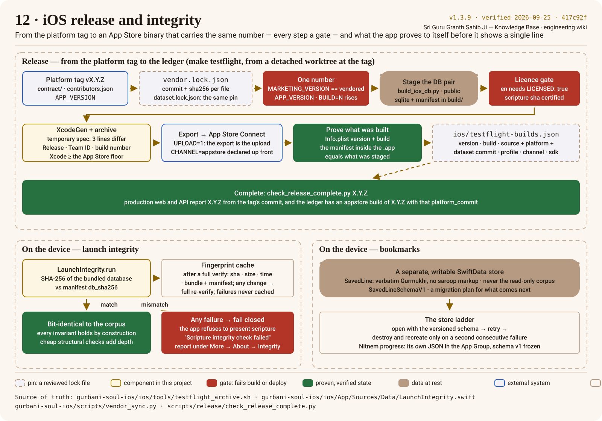

# Database pair and launch integrity

The app carries the scripture with it. Two files travel together — `sggs-ios.sqlite` and
`sggs-ios.manifest.json` — and the manifest's checksums are what every gate, from the archive
script to the app's own launch, verifies against. The poster follows a release from the vendor sync
to the ledger, then the two ladders that run on the device.

## Two profiles, one builder

`pipeline/build_ios_db.py` (owned by sggs-data, vendored at the dataset's commit) derives the iOS
database from the pinned `db/sggs.sqlite` and writes the manifest beside it:

| Profile | Contents | May ship publicly? |
|---|---|---|
| `personal` | every table, including the English translations and `fts_en` | only with `LICENSED: true` in `ios/Resources/TRANSLATION-LICENSE.md` — the Khalsa translation is personal-use until licensed in writing |
| `public` | Gurmukhi-only: the translation layer dropped, everything else verbatim (timing, banis, insights included) | yes — the profile the App Store build uses |

The manifest records the profile, the database's `db_sha256`, the `scripture_sha256` (a checksum
over the scripture rows alone, the same definition sggs-data's fingerprint uses), whether English
is bundled, the byte size and the tables. On a developer's machine the pair is git-ignored for the
database and tracked for the manifest; `make ios-db-check` proves they agree after a branch switch
and `make ios-db-repair` re-derives the database without touching git.

## The licence gate

<!-- sggs:code file="pipeline/check_release_license.sh" lines="1-25" repo="gurbani-soul-ios" -->
Source: [`pipeline/check_release_license.sh`](https://github.com/Algorythmos-AI/gurbani-soul-ios/blob/main/pipeline/check_release_license.sh) in gurbani-soul-ios.

The gate runs on the **exact artifact** the archive stages, never on the developer's pair. It
fails a public build that bundles English without the attestation, a database whose
`scripture_sha256` differs from the certified corpus value, an artifact that does not hash to its
manifest, a missing golden suite, or — for an App Store channel — Nitnem's non-SGGS text without
the scholar's `REVIEWED: true`.

## The archive, gate by gate

`ios/tools/testflight_archive.sh` stops at the first failure:

1. **Refuse a dirty tree**, require Xcode at or above Apple's SDK floor, wait for green CI on the
   commit, check the version invariants and the ledger (`--strict` when uploading).
2. **Stage** the database for the chosen profile into `ios/App/build/stage-<version>-<build>/`.
3. **Licence gate** on that artifact.
4. **XcodeGen** a temporary project from a sibling spec that differs from `project.yml` in exactly
   three lines (the name and the two database resource paths → staging); the developer's own
   project is never repointed and neither project is committed.
5. **Archive** the Release configuration with the Team ID and build number from the command
   line, automatic signing; **export** for App Store Connect (with `UPLOAD=1` the export *is* the
   upload).
6. **Prove** what was built: the Info.plist version and build, and the manifest inside the `.app`,
   equal what was staged; then **record** the build in the ledger.

<!-- sggs:code file="ios/tools/testflight_archive.sh" lines="1-48" repo="gurbani-soul-ios" -->
Source: [`ios/tools/testflight_archive.sh`](https://github.com/Algorythmos-AI/gurbani-soul-ios/blob/main/ios/tools/testflight_archive.sh) in gurbani-soul-ios.

## On the device: the launch-integrity ladder

`LaunchIntegrity` is the iOS analogue of `/api/health`: a fail-closed self-test before any
scripture is shown.

<!-- sggs:code file="ios/App/Sources/Data/LaunchIntegrity.swift" symbol="run" repo="gurbani-soul-ios" -->
Source: [`ios/App/Sources/Data/LaunchIntegrity.swift`](https://github.com/Algorythmos-AI/gurbani-soul-ios/blob/main/ios/App/Sources/Data/LaunchIntegrity.swift) in gurbani-soul-ios.

- The SHA-256 of the bundled database is compared with the manifest's `db_sha256`; if it holds,
  the database is bit-identical to the proven corpus and every invariant holds by construction.
- After one **full** streaming verify the app stores a fingerprint (the sha, the file size and
  modification time, the bundle version, the manifest sha). At the next launch, if every field
  still matches, the ~100 MB re-hash is skipped and only the cheap structural checks run; **any**
  mismatch — a fresh install, an update, a repaired bundle, a manifest change — forces a full
  re-verify, and a failure is never cached.
- If anything fails the app refuses to present scripture ("Scripture integrity check failed") and
  shows the report under More → About → Integrity.
- The threat model is **accidents** — corruption, a truncated copy, a bad build — not an attacker:
  anyone who can rewrite a file inside the signed bundle can rewrite the cache too; anti-tamper is
  the code-signing layer's job.

## Bookmarks: a separate store with its own ladder

Saved verses live in a **separate, writable SwiftData store**, never in the read-only corpus
database, and store the verbatim Gurmukhi (no saroop markup). The schema is versioned from the
first TestFlight build so a later change ships as a real migration stage:

<!-- sggs:code file="ios/App/Sources/Persistence/SavedLine.swift" symbol="SavedLineSchemaV1" repo="gurbani-soul-ios" -->
Source: [`ios/App/Sources/Persistence/SavedLine.swift`](https://github.com/Algorythmos-AI/gurbani-soul-ios/blob/main/ios/App/Sources/Persistence/SavedLine.swift) in gurbani-soul-ios.

Opening the store climbs its own ladder: the versioned schema with its migration plan first; if
that fails, a retry; the store is **destroyed and recreated only on a second consecutive failure**,
so a transient error never costs a reader their bookmarks. Nitnem progress is a separate JSON file
in the App Group with a frozen v1 schema ([Nitnem for engineers](nitnem-for-engineers.md)).
