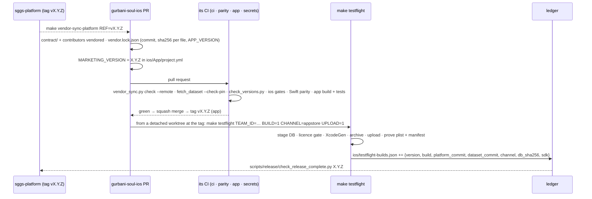

# How the app takes a release

A platform release ends with a tag `vX.Y.Z` on `main` ([the delivery pipeline](../process/branching.md)).
It is **complete** only when the App Store binary reports the same number from the same platform
commit. Between the two sits a small, fully mechanical flow in the app repository.

## 1. Vendor the release

`make vendor-sync-platform REF=vX.Y.Z` re-vendors the platform's golden contract
(`contract/_meta.json`, every `contract/golden_*.ndjson`) and the contributors roster at the tag,
**at the same paths they have upstream**, and records in `vendor.lock.json` the source commit, the
sha256 of every file and the platform's `APP_VERSION` at that ref. Vendored files are never edited
in the app repository; CI rejects a local edit.

<!-- sggs:code file="scripts/vendor_sync.py" lines="1-20" repo="gurbani-soul-ios" -->
Source: [`scripts/vendor_sync.py`](https://github.com/Algorythmos-AI/gurbani-soul-ios/blob/main/scripts/vendor_sync.py) in gurbani-soul-ios.

The dataset is a separate pin: `dataset.lock.json` there names the same sggs-data commit as this
platform's, and `make vendor-sync-data` re-vendors the iOS database builder from that commit.

## 2. One number, enforced

`MARKETING_VERSION` in `ios/App/project.yml` must equal the vendored platform version
(`scripts/release/check_versions.py` there; [ADR-0004](../adr/0004-unified-semver.md) here).
`CURRENT_PROJECT_VERSION` stays at the floor `1`; every upload passes `BUILD=N` explicitly and the
ledger keeps N monotonic within a marketing version, so a 20-minute archive never discovers Apple's
rejection of a reused build number.

## 3. The pull request and the app's gates

| Job | Proves |
|---|---|
| `ci · gates` | every vendored file equals its lock entry **and** its source at the pinned commit (`vendor_sync.py check --remote`); sggs-data publishes the pinned database; the version invariants; the iOS source, listing and archive gates (`ios/tests`) |
| `iOS fidelity gate · parity` | both database profiles build; the Swift kit's parity suites pass against the vendored contract on the derived database |
| `iOS fidelity gate · app` | the app builds and its unit and UI tests pass on a simulator |
| `security · secrets` | no secret in the tree |

PRs are squash-merged; the app then tags its own `vX.Y.Z`.

## 4. The archive, from the tag

`make testflight TEAM_ID=… BUILD=N CHANNEL=appstore UPLOAD=1` is the **only** sanctioned way to
build a candidate, run from a clean detached worktree at the tag. It refuses a dirty tree, waits
for green CI on the commit, checks the version invariants and the ledger, then stages the
database, runs the licence gate, generates a temporary Xcode project, archives, uploads, and proves
what was built — the whole chain is [poster 12](db-pair-and-launch-integrity.md).
`CHANNEL=appstore` is declared up front: it makes the Nitnem scholar-review attestation a hard
requirement, and only a build recorded with that channel may be submitted
(`make appstore-preflight`).

## 5. The ledger

`ios/testflight-builds.json` is the tracked, append-only source of record for every upload. Each
row carries the version and build, the app's `source_commit`, the `platform_commit` whose contract
the binary vendors, the `dataset_commit`, the database profile, the channel, the bundled
`db_sha256`, the Xcode and SDK versions and the upload time. It is committed with the release.

<!-- sggs:code file="ios/tools/testflight_ledger.py" lines="1-28" repo="gurbani-soul-ios" -->
Source: [`ios/tools/testflight_ledger.py`](https://github.com/Algorythmos-AI/gurbani-soul-ios/blob/main/ios/tools/testflight_ledger.py) in gurbani-soul-ios.

## 6. Complete

<!-- sggs:code file="scripts/release/check_release_complete.py" lines="1-20" -->
Source: [`scripts/release/check_release_complete.py`](../../scripts/release/check_release_complete.py) in this repository.

The check reads the ledger from the app repository's `main` and asserts that production's web and
API report `X.Y.Z` from the commit the platform tag points at, and that an `appstore` build of
`X.Y.Z` was built against that same commit. It is the last step of the release skill and of
`make verify-prod --ios`.

## Hotfixes

A one-sided fix is never shipped: a web or iOS fix bumps the **patch** everywhere, and the app
re-archives at the new tag. The App Store has no binary rollback, so the app repository's
hotfix runbook expires the bad TestFlight build, pauses a phased release and ships forward.
