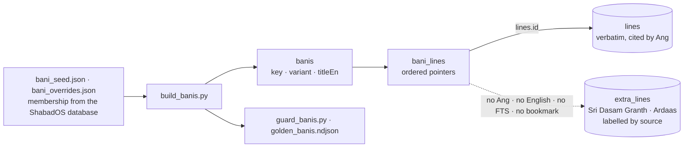

# Nitnem for engineers

[[Nitnem]] — the daily banis — is where the app most needs the prime directive spelled out in data
structures. The corpus has no notion of a bani, several banis are not in Sri Guru Granth Sahib Ji
at all, and one differs by tradition. [ADR-0006](../adr/0006-bani-registry-over-verbatim-corpus.md)
answers all three without ever copying or blending text.

## The registry

- **A bani is an ordered list of pointers.** For every Sri Guru Granth Sahib Ji line the pointer is
  `lines.id`; the text rendered is always this project's own reconciled corpus, cited
  "Sri Guru Granth Sahib Ji · Ang N". Membership and group boundaries come from the ShabadOS open
  database, resolved to our line ids by text match with explicit, reasoned overrides; inside a
  group the order is our printed order.
- **Non-SGGS text lives in `extra_lines`** — Jaap Sahib, Tav-Prasad Savaiye, Benti Chaupai
  (Sri Dasam Granth, with its Panna) and Ardaas — converted verbatim, labelled by source, never
  indexed by FTS, never given an Ang or a translation, never mixed into `lines`, and not
  bookmarkable, shareable or in the Study Trail.
- **Variants** share a key: Rehras Sahib `sgpc` (default) and `taksal`; Asa Di Vaar `kirtan`
  (default, the chhants of Angs 448–451 interleaved) and `printed` (the Vaar exactly as printed,
  Angs 462–475). A range-defined variant carries **verbatim text anchors** — the opening line's
  prefix, the closing line's exact text, the markers before it — re-checked by `build_banis.py`
  on every build and by `guard_banis.py` in CI, so a corpus rebuild that shifts ids fails loudly.
- **Proof.** The registry is additive (older databases report `banis_available: false` and the
  apps hide the feature); `contract/golden_banis.ndjson` pins every bani's line sequence and a
  SHA-256 of its [[Gurmukhi]], replayed by the app's `BaniParityTests`.

## Numbering without guessing

Pauri, ashtapadi and salok numbers come **only** from the markers the scripture prints
(`BaniLine.markers`, bare Gurmukhi digits) or a Dasam line's trailing numeral, through
`BaniOutline` — a pure function with a strict validity gate: if the parsed numbers are not the
sequence they must be, the outline is empty and the app hides Contents rather than show a guessed
number. Numbers appear only outside the verse: a contents sheet, a caption, a margin label.

<!-- sggs:code file="ios/Packages/GurbaniSearchKit/Sources/GurbaniSearchKit/BaniOutline.swift" lines="1-25" repo="gurbani-soul-ios" -->
Source: [`BaniOutline.swift`](https://github.com/Algorythmos-AI/gurbani-soul-ios/blob/main/ios/Packages/GurbaniSearchKit/Sources/GurbaniSearchKit/BaniOutline.swift) in gurbani-soul-ios.

## The Nitnem day, bands and progress

- **One clock.** `NitnemClock` is the single source of "now" for the home, the reader, the widgets
  and the reminders (it honours `SGGS_CLOCK_NOW` in tests). A Nitnem day rolls at **03:00**
  (`dayKey(now − 3h)`): Kirtan Sohila read at 22:00 is still complete at 00:30.
- **Bands only order the home**: Amrit Vela 03:00–09:00, morning banis 09:00–17:00, evening
  17:00–21:00, night otherwise. Nothing is hidden by the band.
- **Progress** is `nitnem-progress.json` in the App Group, **schema v1, frozen**: per bani the last
  sequence and time, the completed days, and since v1.3.0 a verbatim `anchor` plus `nLines` so a
  saved position survives a registry rebuild. A file written by a newer schema is loaded read-only
  and never overwritten. The reading journey is computed from the completed days; custom sets go
  in a separate file later.
- **Two contexts, one reader.** The same bani reader serves Nitnem (next bani in the band, the
  band-complete card) and Explore (the next composition on the rail); scripture, outline, settings
  and the saved position are identical, keyed by `key` or `key/variant`.

## The review gate

The "verbatim, proven character for character" claim is scoped to Sri Guru Granth Sahib Ji lines
wherever it is made. The non-SGGS layer is not covered by the reconcile proof, so it ships to the
App Store only after a scholar's review is attested in `ios/Resources/NITNEM-REVIEW.md`
(`REVIEWED: true`) and the in-app "under scholarly review" label is switched off in the same
commit. `check_release_license.sh` treats a missing attestation as a warning for a TestFlight
build and a hard failure for `CHANNEL=appstore`; `make appstore-preflight` refuses to submit a
build that was not archived on that channel. The full contract — reading steps, frozen XCUITest
identifiers, deep links — is the pinned
[Nitnem spec](https://github.com/Algorythmos-AI/gurbani-soul-ios/blob/main/docs/nitnem/spec.md).
