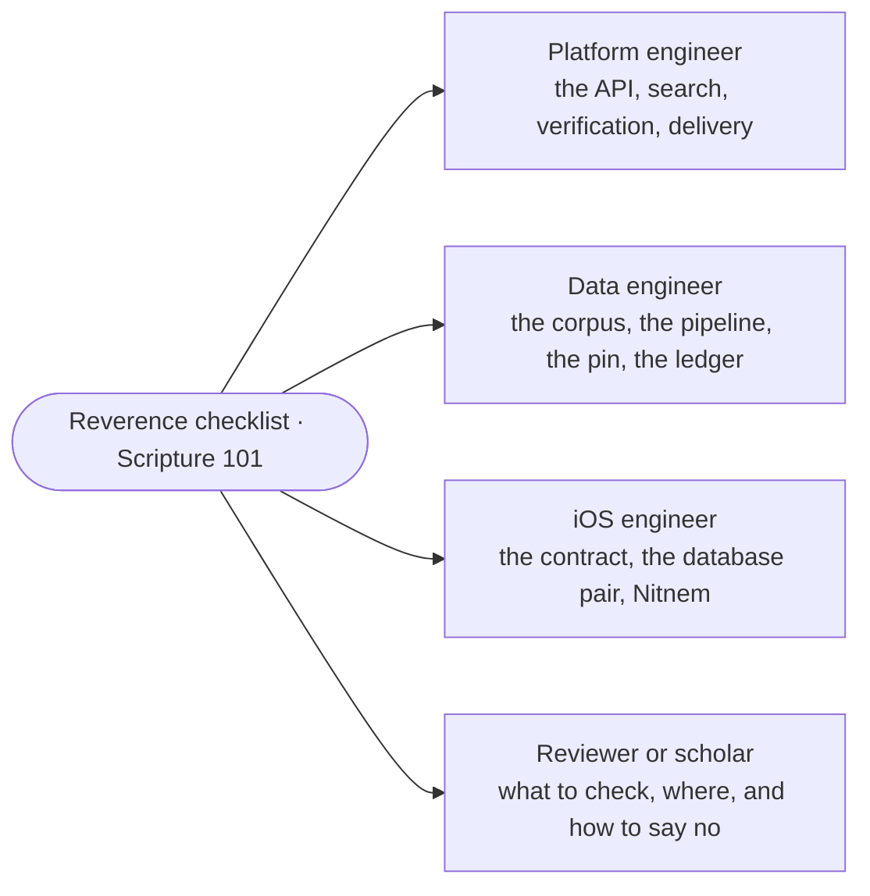

# Learning paths

A path is a checklist: pages to read and exercises to do, in an order that builds on itself. Tick
items as you go — the ticks are remembered in your browser only (nothing is sent anywhere) — and
start again whenever you like. Every path begins with the same two stops: the
[reverence checklist](../onboarding/reverence-checklist.md) and
[Scripture 101](../scripture/README.md), because the one rule of this project comes before any
code.

| Path | For | Time |
|---|---|---|
| [Platform engineer](platform-engineer.md) | someone who will change the API, the website or the pipeline that ships them | about two days |
| [Data engineer](data-engineer.md) | someone who will work on the corpus, the database, the gates or a dataset release | about two days |
| [iOS engineer](ios-engineer.md) | someone who will change the app | about a day and a half |
| [Reviewer or scholar](reviewer-scholar.md) | a Granthi, a scholar or a maintainer who reviews changes and never writes code | half a day |

Each exercise on a path is runnable with `make` targets alone and says what output to expect;
the [exercises index](../exercises/README.md) lists them all.
