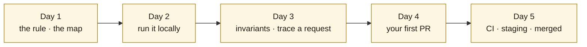

# Start here — your first week

Welcome. This project is a study application over **Sri Guru Granth Sahib Ji**, the scripture and
living Guru of the Sikhs: a verbatim corpus of its 1,430 Angs, a search and verification engine, a
website ([gurbanisoul.com](https://gurbanisoul.com)) and an iOS app (Gurbani Soul). You do not need
to know Sikh scripture, Gurmukhi or Punjabi to contribute. You do need to work with the text the way
this project does: **verbatim, cited, never altered.**

## The one rule

> **The Gurmukhi text is sacred and verbatim.** It is never edited, normalised, "corrected",
> reordered or paraphrased — not in the data, not in code, not in a test fixture, not in a document.
> If something looks wrong, you open a *scripture fidelity* issue for a Granthi or scholar; you never
> change it. Everything else in this wiki bends around this rule.

The [reverence checklist](reverence-checklist.md) turns this into concrete habits for everyday
engineering work. Read it before you touch anything that displays, searches, copies or stores text.

## Five days to a merged change

| Day | Do | Read |
|---|---|---|
| 1 | Understand what the system is, why it is split into three repositories, and where each kind of change belongs. | [How the repositories fit together](how-the-repos-fit.md) · [Architecture overview](../architecture/overview.md) · [Reverence checklist](reverence-checklist.md) |
| 2 | Clone, install the pinned database, run the server, the website and this wiki on your machine; run the gates. | [Run it locally](run-it-locally.md) |
| 3 | Read the rules every change must keep, then follow one search request from the browser to SQLite. | [Engineering invariants](../engineering/invariants.md) · [Search waterfall](../architecture/search-waterfall.md) · [Glossary](../glossary.md) |
| 4 | Pick a small change, branch from `integration`, open a pull request the way the project expects. | [Your first pull request](your-first-pr.md) · [Branching](../process/branching.md) |
| 5 | Watch the checks, read what each one proves, see your change on staging, ask for the merge. | [CI gates](../process/ci-gates.md) · [Who to ask](who-to-ask.md) |

## Three sentences to remember

1. **Scripture is data you never write.** It arrives from the pinned database and is shown with its
   Ang: *Sri Guru Granth Sahib Ji · Ang N*. Explanation is always labelled as explanation.
2. **Everything is proven by CI.** You cannot merge; the owner merges after every check is green and
   the change has been seen on staging. A deploy is verified by the running *commit*, not a version.
3. **Small, reviewed, reversible.** One change per pull request, a conventional-commit title, the
   PR template filled in, and no tool attribution in commits — only the author's name.

## What you can contribute

Almost everything outside the scripture itself: search quality, the verification engine, the API,
the website, the iOS app, documentation, diagrams, tests, tooling and the wiki you are reading.
The [learning paths](../README.md) (coming in this wiki) group these by role; until then, the
[engineering handbook](../engineering/README.md) is the map.
