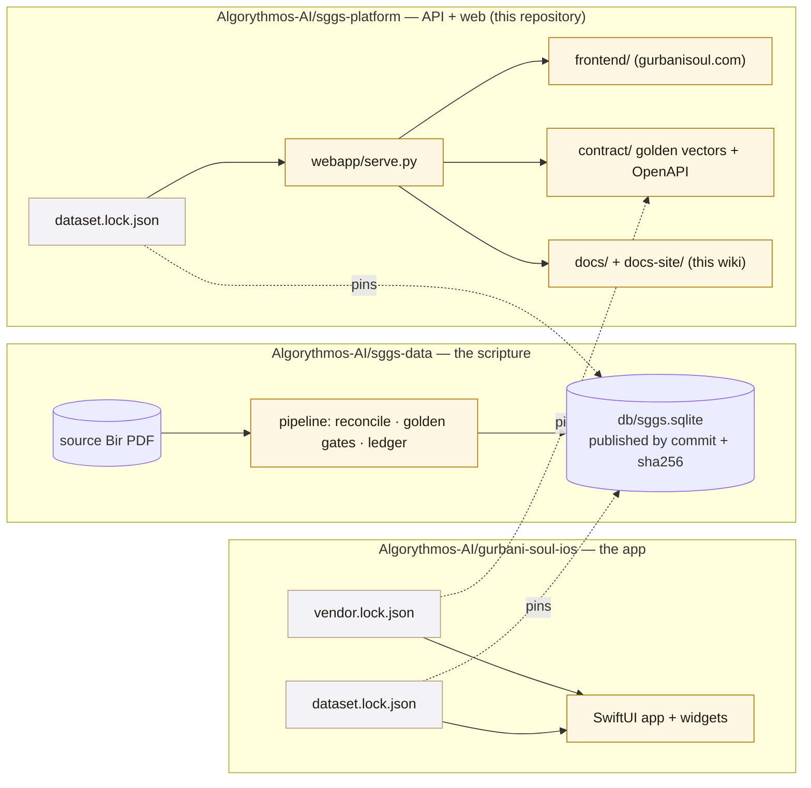

# How the repositories fit together

Since release 1.3.8 the project is three repositories joined by **pins**: small, reviewed files that
name an exact commit and the checksum of the artifact taken from it
([ADR-0007](../adr/0007-three-repositories.md), [ADR-0008](../adr/0008-dataset-by-pin.md)). Nothing
is copied by hand between them, so nothing can drift.

## What lives where

| Repository | Owns | You go there to… |
|---|---|---|
| **sggs-data** | the source PDF's corpus, the SQLite/FTS5 database, the rebuild pipeline, the scripture gates (character-exact reconcile, golden checks, the editorial ledger), the answer protocol, the validation reports | change anything about the *text* or how it is extracted, indexed or proven — always with a scholar's review |
| **sggs-platform** (this one) | the stdlib API (`webapp/`), the website (`frontend/`), the golden contract (`contract/`), tooling (`tools/`, `scripts/`), CI, and this wiki (`docs/`, `docs-site/`) | change search, verification, the API, the website, delivery, documentation |
| **gurbani-soul-ios** | the iOS app, its widgets, its bundled database pair, TestFlight and App Store tooling, the Nitnem registry | change the app |

A fourth, private repository (`sggs-source`) holds the backup of the source PDF and the private
translation inputs; you will not need it.

## The pins, in one table

| Pin | Lives in | Names | Bump it when |
|---|---|---|---|
| `dataset.lock.json` | platform, app | an sggs-data commit + the database's sha256 and size | a new dataset was built and reviewed in sggs-data |
| `vendor.lock.json` | app | a platform release tag + the sha256 of each vendored contract file | the platform released `vX.Y.Z` |
| `docs-site/sources.lock.json` | platform (this wiki) | a sibling commit + the sha256 of each published doc | the sibling's docs changed and should appear here |

A pin bump is an ordinary pull request: small, reviewed, gated. `make dataset` installs the pinned
database; `make dataset-check` proves sggs-data publishes exactly that object at that commit.

## One version number

The web footer, `/api/meta`, `/api/health`, the iOS About screen and the App Store all report the
same `X.Y.Z` ([ADR-0004](../adr/0004-unified-semver.md)). Every platform release is re-archived as
iOS `X.Y.Z (1)` from the release tag, even a web-only change. The dataset has its own version
(`db_version`), released on its own cadence through the pin.

## Where does my change go?

- *Search returns the wrong line for a spelling* → platform (`webapp/sggs/search.py`, the fold in
  `webapp/romannorm.py`) — and if the fold changes, it must change byte-identically in sggs-data
  and the app (the golden vectors prove it).
- *A verse looks wrong on screen* → **do not edit anything**; open a
  [scripture fidelity issue](https://github.com/Algorythmos-AI/sggs-platform/issues/new?template=scripture-fidelity.yml).
- *A page on the website* → platform (`frontend/`).
- *A screen in the app* → gurbani-soul-ios.
- *This wiki* → platform (`docs/`; the site itself in `docs-site/`).
- *A decision about how we work* → an ADR in `docs/adr/`, proposed in a pull request.
