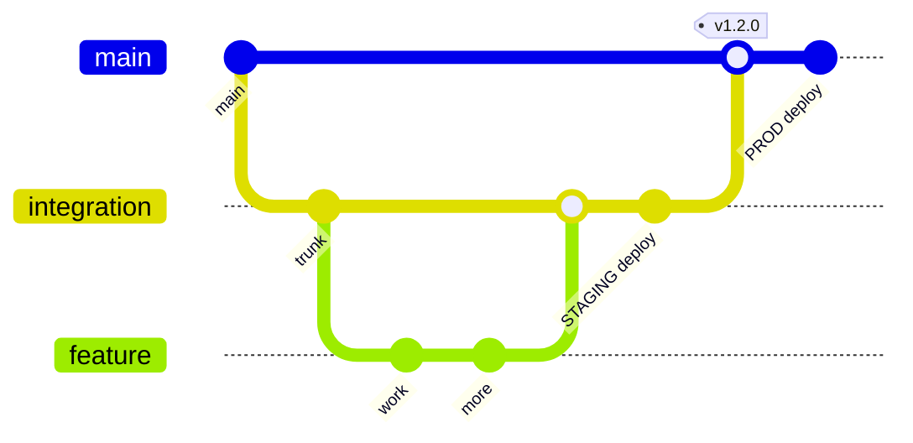

# Branching & Delivery Flow

## Rules
- **`integration` is the trunk.** Branch `feature/*` or `fix/*` from it; open a PR
  back into `integration`. Merging to `integration` deploys **staging** (web +
  Render + TestFlight internal).
- **`main` is production.** It only ever receives a **release PR from `integration`**
  (or `hotfix/*`). The `version-consistency` gate enforces the source branch.
  Merging to `main` tags `vX.Y.Z`, cuts a GitHub Release, and deploys production.
- **`hotfix/*`** branches from `main` for urgent production fixes, then is
  back-merged into `integration`.

## Merge strategy (important)
| PR | Merge method | Why |
|---|---|---|
| `feature/*`, `fix/*` → `integration` | **Squash** | one clean commit per change on the trunk |
| `integration` → `main` (release) | **Merge commit** | `main` stays a descendant of `integration`, so branches never diverge and no back-merge is needed |
| `hotfix/*` → `main` | Squash, then merge `main` → `integration` | keeps the trunk current |

`main` therefore does **not** require linear history (a squash/rebase release would
rewrite SHAs and make every later release PR conflict).

## Required checks (once the owner is on GitHub Team)
Applied from `.github/rulesets/` via `scripts/gh/apply_rulesets.sh`:
- `main`: PR + 1 approval + CODEOWNERS + linear history + `web-ci`, `scripture-integrity`,
  `version-consistency`, `security` green; tags `v*` protected.
- `integration`: PR + CODEOWNERS + `web-ci`, `scripture-integrity`, `security` green.

## PR hygiene
Conventional-commit titles (`fix(data): …`), small diffs, `Closes #NN`, the
scripture-safety checklist in the PR template completed for any corpus/db change.
