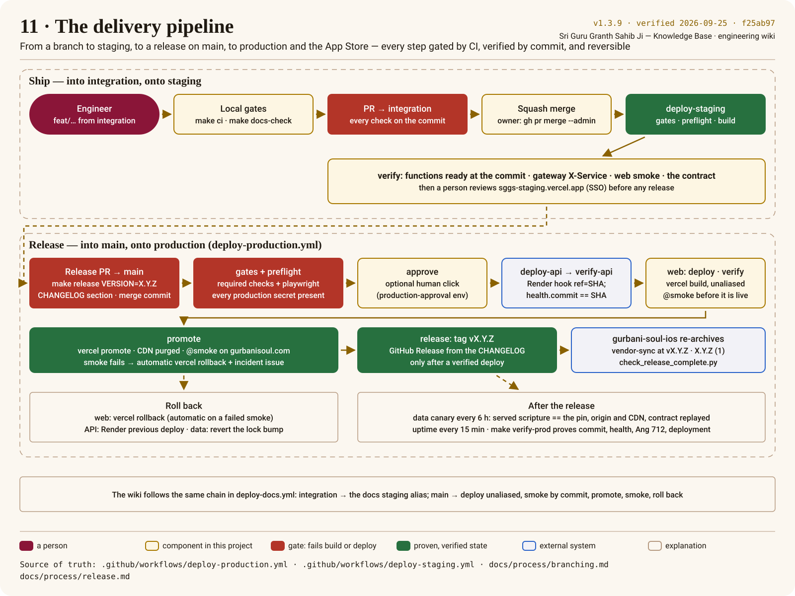
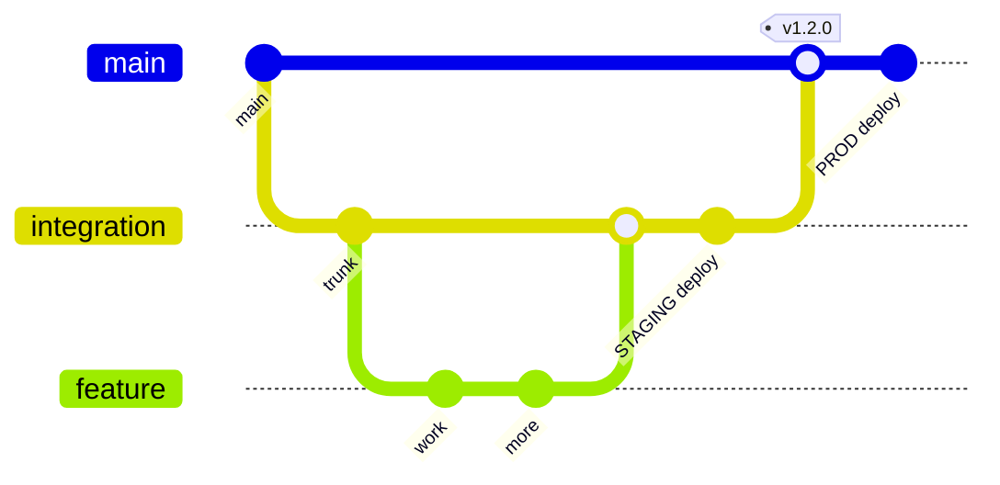

# Branching & Delivery Flow

The whole journey, from a branch to production and the App Store, as the pipeline runs it — press
*Next* on the site to walk it:

## Rules
- **`integration` is the trunk.** Branch `feature/*` or `fix/*` from it; open a PR
  back into `integration`. Merging to `integration` deploys **staging** (the web with
  the API as Vercel functions inside it, ADR-0011). TestFlight uploads are **manual** and happen in the app
  repository (gurbani-soul-ios) — no merge here uploads a build.
- **`main` is production.** It only ever receives a **release PR from `integration`**
  (or `hotfix/*`). The `version-consistency` gate enforces the source branch.
  Merging to `main` tags `vX.Y.Z`, cuts a GitHub Release, and deploys production.
- **`hotfix/*`** branches from `main` for urgent production fixes, then is
  back-merged into `integration`.

## Merge strategy (important)
| PR | Merge method | Why |
|---|---|---|
| `feature/*`, `fix/*` → `integration` | **Squash** | one clean commit per change on the trunk |
| `integration` → `main` (release) | **Merge commit** | `main` stays a descendant of `integration`, so branches never diverge and no back-merge is needed |
| `hotfix/*` → `main` | Squash, then merge `main` → `integration` | keeps the trunk current |
| wiki PRs that move a `verified` stamp → `integration` | **Merge commit** | a stamp names a commit on the PR branch; a squash drops it from history and the stamp stops resolving |

`main` therefore does **not** require linear history (a squash/rebase release would
rewrite SHAs and make every later release PR conflict).

## Required checks
Applied from `.github/rulesets/` via `scripts/gh/apply_rulesets.sh` (the JSON files are the
source of truth — keep this list in step with them). The script **merges** each file into the live
ruleset (`scripts/gh/merge_ruleset.py`): keys GitHub added that the file does not mention are kept,
never reset to a weaker default. Run it with `--dry-run` first; it prints exactly what would change.
- `main`: PR + 1 approval + CODEOWNERS + resolved threads + strict status checks `python`,
  `frontend`, `integrity`, `versions`, `secrets`, `static-analysis`, `docs`; no deletion or force-push.
  `docs` gates the **merge** only: `deploy-production` waits on every other required check but not
  on the wiki's (`wait_for_checks.py --exclude docs`), which deploys the wiki on its own.
  **No linear-history rule** (see Merge strategy).
- `integration`: PR + CODEOWNERS + checks `python`, `frontend`, `integrity`, `secrets`, `docs` (the
  wiki job, ADR-0012); no deletion or force-push.
- Tags `v*`: no deletion or force-push.
- `playwright` and the iOS jobs are not required checks, but `deploy-staging` /
  `deploy-production` wait for `playwright` on the exact commit before deploying.

## PR hygiene
Conventional-commit titles (`fix(data): …`), small diffs, `Closes #NN`, the
scripture-safety checklist in the PR template completed for any search, verify, display or dataset-pin change.
