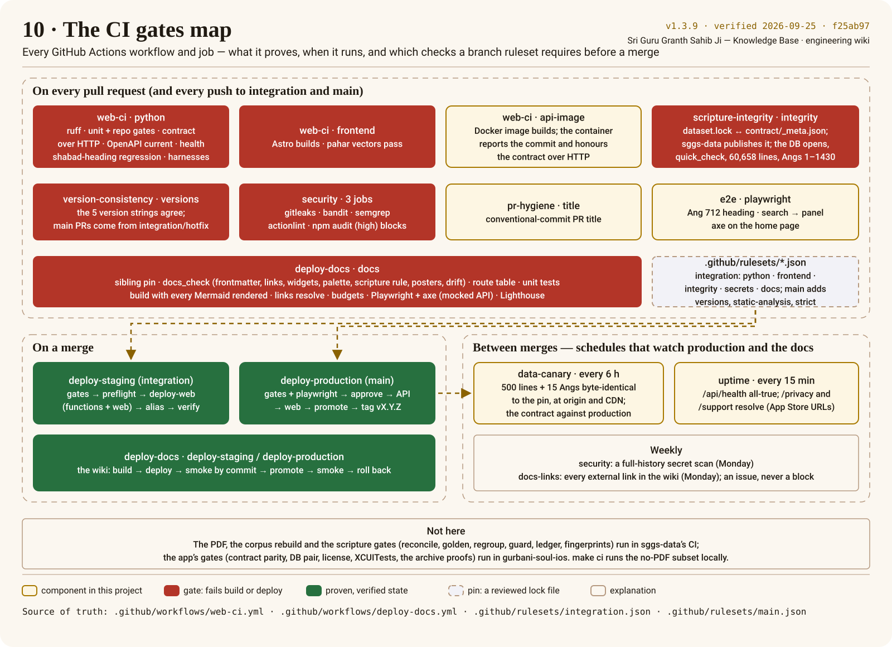

# CI Gates — what each check proves

| Workflow · job | Proves | Needs |
|---|---|---|
| `web-ci · python` | ruff clean; server + repo-gate unit tests; the **golden contract replayed over HTTP** (`tools/contract_http.py`); `contract/openapi.json` is current and covers every dispatcher route; `/api/health` all-true; the **shabad-heading regression** (`api_superset_check`); search harnesses; **contract does not drift** | pinned DB |
| `web-ci · frontend` | Astro builds; `pahar` vectors pass | Node 22 |
| `scripture-integrity` | dataset pin: `dataset.lock.json` ↔ `contract/_meta.json`, and sggs-data publishes that object at the pinned commit; the installed DB passes `quick_check` with 60,658 lines over Angs 1–1430 (the scripture gates themselves run in sggs-data) | pinned DB |
| `version-consistency` | all 5 platform version strings unified (the dataset versions in sggs-data; the iOS app keeps its own match); `main` PRs come from `integration`/`hotfix` | — |
| `security` | gitleaks; bandit; semgrep OSS; actionlint; **blocking** `npm audit --audit-level=high` on `frontend/` and `docs-site/` (job `deps`) | — |
| `pr-hygiene` | conventional-commit PR title | — |
| `e2e · playwright` | Ang 712 heading smoke, search → panel heading, axe WCAG on the home page (desktop project) | serve.py + pinned DB |
| `web-ci · api-image` | Docker image builds; the running container reports the build commit **and honours the golden contract over HTTP** | Docker |
| `deploy-verify` (on Vercel `deployment_status`, previews only) | preview `/api/health` all-true (passes with a notice without the repo-level bypass secret) | — |
| `release` (manual fallback) | idempotent tag + GitHub Release on `main`; normal releases are cut by `deploy-production` after a verified deploy | — |
| `data-canary` (every 6 h, not a PR check) | production serves the pinned scripture byte for byte: 500 random lines (`/api/lines`) and 12 random Angs plus Angs 1, 712, 1430 (`/api/ang/N`), from the API origin **and** through the public site's CDN; the golden contract replays against production; a failure opens or updates one issue | pinned DB |
| `deploy-staging · deploy-web` | the API functions are generated at the commit from the pinned database (slices proven); after `vercel build` every function bundles only its entry, the API code and its own database, and no database or API source is in the static output | pinned DB |
| `deploy-staging · verify` | every API function's `/readyz` reports this commit and exactly its contexts; no API file is downloadable; the web smoke; every routed context answers **through the gateway** with its own `X-Service`; an unknown prefix falls through to `all`; the **whole golden contract passes through the gateway** | bypass secret, pinned DB |
| `deploy-docs · docs` (**required on `integration`**) | the wiki (`docs-site/` over `docs/`, ADR-0012): pinned sibling docs consistent and installed; `tools/docs_check.py` (frontmatter, links and anchors, widget fallbacks, Mermaid palette, the scripture-quotation rule, posters, the `verified` stamps on process/engineering/architecture pages, drift against the code: search modes, verify thresholds, generated pages; the poster legend; the site theme's brand colours equal `docs/brand/tokens.json`; the CSP allows inline scripts by hash only); `tools/gen_route_table.py --check`; `scripts/brand/contrast_report.py --check` (the committed contrast report equals a regeneration from `docs/brand/tokens.json`, frontmatter included); tool and plugin unit tests; types (`astro check`); the site builds with **every Mermaid fence rendered to SVG**; every page rendered completely; every internal link and fragment in the built HTML resolves; page budgets (JS ≤ 60 KB gz); every inline script allowed by its sha256 in the CSP, no inline handlers (`scripts/csp.mjs`); Playwright e2e (mocked API) + axe on every built page, **served with the production headers and CSP** (a blocked script fails the check); Lighthouse on twenty pages (performance ≥ 0.9, accessibility 1, best-practices ≥ 0.95); every page's Open Graph card exists | Node 22, Chromium |
| `deploy-docs · deploy-staging` / `deploy-production` | the wiki is deployed only by CI: `integration` → `sggs-docs-staging.vercel.app` (refuses to be the project's first deployment, fails unless its own deployment is a preview); `main` → record the deployment the domain serves, build, deploy unaliased, smoke by commit, promote to `docs.gurbanisoul.com`, smoke again, roll back to the recorded deployment if the public smoke fails; every failure opens an issue (`scripts/ci/docs_smoke.py`, `scripts/ci/vercel_api.py`). The smoke fails on any redirect. After every staging deploy the live suite runs against staging with the bypass header | docs Vercel project secrets |
| `deploy-docs · main-guard` | a push to `main` whose `docs` job did not succeed never deploys the wiki; this job opens an issue saying so | — |
| `deploy-docs` nightly (`schedule`) | the whole `docs` job re-runs on `integration` every night, to catch drift from outside the repository (npm, Starlight, sibling docs, the dataset); a red night opens one issue, the next green night closes it | — |
| `docs-links` (weekly, not a PR check) | every external link in `docs/` and in the sibling docs the wiki publishes still resolves (lychee, policy in `.lychee.toml`); a failure opens or updates one issue, never blocks | — |
| `uptime` (every 15 min, not a PR check) | production `/api/health` all-true; `/privacy` and `/support` (the App Store URLs) resolve with their content; a failure opens or updates one issue. Job `docs`: the wiki's landing page and `/api/health` through its rewrite, with no redirect (its own issue) | — |
| `docs-watch` (every 6 h, not a PR check) | `docs.gurbanisoul.com` serves the commit the last successful `deploy-docs` run on `main` shipped (a domain changed outside CI fails it), `docs_smoke.py` passes, and the **live suite** (`docs-site/e2e-live`) passes against the real API: status strip, search, the Ang explorer on Angs 1/712/1256, a line read from the API verifying exact, the API console, ⌘K search, axe as deployed, no CSP errors. One issue, closed when green | — |
| `docs-pins` (Mondays, not a PR check) | when a sibling repository changes a file the wiki publishes, a pull request moves its pin (`tools/docs_pins.py`; a commit that touched nothing published moves nothing); opened with `DOCS_BOT_TOKEN` so the required checks run (after a dry-run push proves the token can write), or one issue — naming the cause — when the secret is absent, cannot push, or the pull-request step fails | `DOCS_BOT_TOKEN` (optional) |
| `docs-freshness` (Mondays, not a PR check) | lists the stamped pages whose cited code (excerpts, linked source files, the posters' "Source of truth") changed since their `verified` stamp, then pages far behind; one issue rewritten weekly, closed when every page is fresh (`tools/docs_check.py --freshness`) | — |

The PDF, the corpus rebuild and the scripture gates (reconcile attestation, regroup invariants,
scripture guard, editorial ledger, fingerprints) belong to `Algorythmos-AI/sggs-data` and run in its
CI. The iOS app's gates run in `Algorythmos-AI/gurbani-soul-ios`.

Run the no-PDF subset locally with `make ci`.

`npm audit` has been **blocking** since the Astro 7 upgrade cleared the advisory backlog
(2026-09-20): a new high/critical advisory in `frontend/package-lock.json` fails `security · deps`.
Fix it with `npm audit fix` (never `--force` blind — read the migration notes), rebuild, and
re-sync `webapp/static/`; do not re-add `|| true`.

## Deploy pipeline
`deploy-production` (push to `main`) waits for the required checks above **plus `playwright`**
on the exact commit, then deploys API → verifies → builds web unaliased → smoke → promotes →
smoke public → tags. Details: [runbook: deploy](runbooks/deploy.md).

## Not yet wired (roadmap)
`perf` (latency budget + Lighthouse on staging) and a load/soak test — nothing yet exercises the
request-cost limits this repo now enforces (the /api/verify claim cap, the socket timeout, the
bounded worker pool). `npm audit` is already blocking (see the `security` row above).
