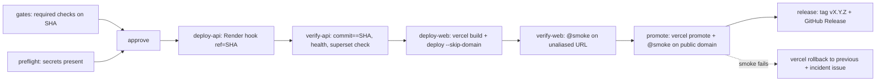

# Runbook: Deploys (CI-gated)

Production deploys are performed by **`.github/workflows/deploy-production.yml`**, on
every push to `main` (a merged release PR) or manually via *Run workflow*. Nothing
reaches users unless every required check on that exact commit is green.



## What each gate proves
| Job | Proves | On failure |
|---|---|---|
| gates | every required check (from `.github/rulesets/main.json`) + `playwright` succeeded on this SHA | nothing deployed |
| preflight | all production secrets exist | nothing deployed |
| approve | optional human click (add reviewers to env `production-approval`) | nothing deployed |
| deploy-api | Render runs **this commit** (`/api/health.commit == SHA`) and is healthy | web untouched; old API keeps serving until Render switches |
| verify-api | 100 sampled compositions serve exact lines, headings present, gaps 404 | incident issue; **roll back Render** (rollback.md) |
| deploy-web / verify-web | the built frontend passes the heading smoke **before** it is live | not promoted — users unaffected |
| promote | public domain serves this commit and passes smoke | automatic `vercel rollback` to the recorded previous deployment + incident issue |
| release | tag + GitHub Release are created only after a verified deploy | re-run the job |

## One-time setup (owner)
1. GitHub → Settings → Environments → **`production`**: Deployment branches = `main` only. Secrets:
   - `VERCEL_TOKEN` (vercel.com/account/tokens, scope *skalaliyas-projects*)
   - `VERCEL_ORG_ID` = `team_zdvzZQr6joigVUzLFhQbxXfI`
   - `VERCEL_PROJECT_ID` = `prj_ojl2Klc89syjmgUcqfra3ahvOZnC`
   - `VERCEL_AUTOMATION_BYPASS_SECRET` (Vercel → project → Settings → Deployment Protection → Protection Bypass for Automation)
   - `RENDER_DEPLOY_HOOK_PROD` (Render → service → Settings → Deploy Hook)
2. Optional: Environments → **`production-approval`** → Required reviewers = you.
3. The Render and Vercel **GitHub Apps must be installed on the `Algorythmos-AI` org** (Render clones the repo to build; `ref=` must exist there).

## Preview checks (optional)
`deploy-verify.yml` health-checks feature-branch **preview** deployments. Previews are behind
Vercel Deployment Protection, so it needs a **repo-level** secret (not the `production`
environment one):

```bash
gh secret set VERCEL_AUTOMATION_BYPASS_SECRET --repo Algorythmos-AI/sggs-knowledge-base
```
Without it the check posts a notice and passes. (Previews proxy `/api` to production, so this
is a light smoke, not a gate.)

## Cutover (do in this order)
1. Merge the pipeline to `integration`, then the release PR to `main` (**merge commit**).
   During this first run the platforms' own git deploys may also fire for the same SHA — harmless.
2. After one fully green `deploy-production` run: Render service → **Auto-Deploy: Off**, and
   merge the follow-up PR that sets `frontend/vercel.json` → `git.deploymentEnabled` `main`/`integration` to `false`.
3. Prove idempotency: *Run workflow* on `main` → the same SHA redeploys and passes.
4. Prove the stop: *Run workflow* with `expect_commit=0000000` → it fails in **deploy-api**; no web deploy happens.

## Manual redeploy / hotfix
- Redeploy current `main`: Actions → deploy-production → *Run workflow* (branch `main`).
- Hotfix: `hotfix/*` → PR to `main` (squash) → the pipeline deploys it → merge `main` back into `integration`.

## Concurrency
Runs share the `production` group without cancellation: a run in progress always finishes.
If several pushes queue, GitHub keeps only the newest pending run (older pending runs are replaced).

## If `/api/health.commit` stays `unknown`
The image bakes the commit at build time (`webapp/Dockerfile`: `ARG RENDER_GIT_COMMIT` →
`ENV SGGS_COMMIT`), and serve.py also reads `RENDER_GIT_COMMIT` at runtime. If both are empty,
deploy-api times out with a hint. Check the Render build log for the build arg, then set a
service environment variable `SGGS_COMMIT` manually for that one deploy and re-run the job.
