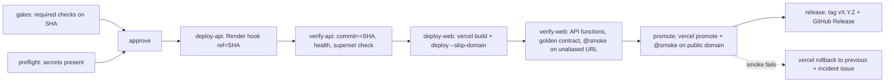

# Runbook: Deploys (CI-gated)

Production deploys are performed by **`.github/workflows/deploy-production.yml`**, on
every push to `main` (a merged release PR) or manually via *Run workflow*. Nothing
reaches users unless every required check on that exact commit is green.



## What each gate proves
| Job | Proves | On failure |
|---|---|---|
| gates | every required check (from `.github/rulesets/main.json`) + `playwright` succeeded on this SHA | nothing deployed |
| preflight | all production secrets exist | nothing deployed |
| approve | optional human click (add reviewers to env `production-approval`) | nothing deployed |
| deploy-api | Render runs **this commit** (`/api/health.commit == SHA`) and is healthy — production's rollback target while `/api` is on the functions | web untouched; old API keeps serving until Render switches |
| verify-api | 100 sampled compositions serve exact lines, headings present, gaps 404 | incident issue; **roll back Render** (rollback.md) |
| deploy-web / verify-web | **before** it is live: every API function is ready at this commit with exactly its contexts and the API's files are not downloadable (`verify_functions.py --env production`), the whole golden contract holds through its `/api` (`contract_http.py`), and the heading smoke passes | not promoted — users unaffected |
| promote | public domain serves this commit and passes smoke | automatic `vercel rollback` to the recorded previous deployment + incident issue |
| release | tag + GitHub Release are created only after a verified deploy | re-run the job |

## One-time setup (owner)
1. GitHub → Settings → Environments → **`production`**: Deployment branches = `main` only. Secrets:
   - `VERCEL_TOKEN` (vercel.com/account/tokens, scope *skalaliyas-projects*)
   - `VERCEL_ORG_ID` = `team_zdvzZQr6joigVUzLFhQbxXfI`
   - `VERCEL_PROJECT_ID` = `prj_ojl2Klc89syjmgUcqfra3ahvOZnC`
   - `VERCEL_AUTOMATION_BYPASS_SECRET` (Vercel → project → Settings → Deployment Protection → Protection Bypass for Automation)
   - `RENDER_DEPLOY_HOOK_PROD` (Render → service → Settings → Deploy Hook)
2. Optional: Environments → **`production-approval`** → Required reviewers = you.
3. The Render and Vercel **GitHub Apps must be installed on the `Algorythmos-AI` org** (Render clones the repo to build; `ref=` must exist there).

## The wiki (docs.gurbanisoul.com) — one-time setup (owner)
The wiki (`docs-site/`, ADR-0012) deploys through `deploy-docs.yml` with the same posture: the
Vercel project's git deployments are off; CI builds, deploys, smokes by commit, promotes, rolls back.
1. **Vercel** — create the project with **no Git connection** (so the platform can never deploy
   it by itself): `vercel project add sggs-docs --scope skalaliyas-projects`, then Settings → Build
   and Deployment → Framework Preset **Astro**. Leave **Root Directory empty** (`.`): the workflow
   runs `vercel pull/build/deploy` from inside `docs-site/`, so a Root Directory of `docs-site`
   would resolve to `docs-site/docs-site` and fail. (The web project differs: its Root Directory
   is `frontend` and its workflow runs from the repository root.)
2. Domains: add **`docs.gurbanisoul.com`** (Production). Cloudflare (zone *Company-Domains*):
   `CNAME docs →` the target Vercel recommends for the domain (Domains → *View DNS configuration*;
   `cname.vercel-dns.com` also works), **DNS-only** (grey cloud), like the apex and `www`.
3. The staging alias `sggs-docs-staging.vercel.app` is claimed by the first staging run
   (`vercel alias set` in `deploy-docs.yml`), and re-pointed on every push to `integration`.
4. GitHub → Settings → Environments → **`staging`** and **`production`**: reuse `VERCEL_TOKEN` and
   `VERCEL_ORG_ID`; add **`VERCEL_DOCS_PROJECT_ID`** (the new project's id) and
   **`VERCEL_DOCS_BYPASS_SECRET`** (Deployment Protection → Protection Bypass for Automation; it is
   per project, so the web project's secret does not work here — Vercel Authentication protects
   every URL except the custom domain, so the staging alias and the unaliased production smoke
   both need it). Never paste a value anywhere else.
5. Until the domain resolves, `deploy-production`'s public smoke fails after promotion and the job
   rolls back; the staging job proves the build in the meantime.

## Staging (review integration before production)
Every push to `integration` runs **`deploy-staging.yml`**: gates (core checks on the SHA) →
staging web deploy with the API inside it → alias to `sggs-staging.vercel.app` → verify. No promote,
no release. Open `sggs-staging.vercel.app` logged in to Vercel (it is SSO-protected).

The API runs as Python functions in the web project (ADR-0011): `tools/build_api_functions.py`
generates one function per bounded context plus `all` from the pinned database (each context's slice
is proven by the slicer), `vercel build` bundles them, and `--verify-output` refuses the build if a
function bundles anything but its entry, the API code and its own database, or if a database or API
source would be published as a static file. After the alias, `scripts/ci/verify_functions.py` checks
every function's `/readyz` (this commit, exactly its contexts, `X-Service`), then the gateway probes,
the web smoke and the whole golden contract run through the staging site.

**One-time staging setup (owner):**
1. **Vercel** — the alias `sggs-staging.vercel.app` already exists (claimed via
   `vercel alias set <deployment> sggs-staging.vercel.app`); CI re-points it each deploy. Nothing to do
   unless you want a nicer domain.
2. **GitHub** → Settings → Environments → **`staging`** (deployment branch `integration`). Secrets:
   `VERCEL_TOKEN`, `VERCEL_ORG_ID`, `VERCEL_PROJECT_ID`, `VERCEL_AUTOMATION_BYPASS_SECRET` (same values
   as `production`). The preflight job fails clearly if any are missing.

## Preview checks (optional)
`deploy-verify.yml` health-checks **preview** deployments. Vercel Git previews of the web are off
(`frontend/vercel.json` → `git.deploymentEnabled: false`: a Git preview carries no API functions,
so its `/api` would point at nothing — review web changes on staging), so it now fires for the
CI-made preview deployments (staging, the wiki). Previews are behind
Vercel Deployment Protection, so it needs a **repo-level** secret (not the `production`
environment one):

```bash
gh secret set VERCEL_AUTOMATION_BYPASS_SECRET --repo Algorythmos-AI/sggs-platform
```
Without it the check posts a notice and passes. It is a light smoke, not a gate: staging and the
wiki are proven by their own deploy workflows.

## Cutover (do in this order)
1. Merge the pipeline to `integration`, then the release PR to `main` (**merge commit**).
   During this first run the platforms' own git deploys may also fire for the same SHA — harmless.
2. After one fully green `deploy-production` run: Render service → **Auto-Deploy: Off**, and
   merge the follow-up PR that sets `frontend/vercel.json` → `git.deploymentEnabled` `main`/`integration` to `false`.
3. Prove idempotency: *Run workflow* on `main` → the same SHA redeploys and passes.
4. Prove the stop: *Run workflow* with `expect_commit=0000000` → it fails in **deploy-api**; no web deploy happens.

## Manual redeploy / hotfix
- Redeploy current `main`: Actions → deploy-production → *Run workflow* (branch `main`).
- Hotfix: `hotfix/*` → PR to `main` (squash) → the pipeline deploys it → merge `main` back into `integration`.

## Concurrency
Runs share the `production` group without cancellation: a run in progress always finishes.
If several pushes queue, GitHub keeps only the newest pending run (older pending runs are replaced).

## If `/api/health.commit` stays `unknown`
The image bakes the commit at build time (`webapp/Dockerfile`: `ARG RENDER_GIT_COMMIT` →
`ENV SGGS_COMMIT`), and serve.py also reads `RENDER_GIT_COMMIT` at runtime. If both are empty,
deploy-api times out with a hint. Check the Render build log for the build arg, then set a
service environment variable `SGGS_COMMIT` manually for that one deploy and re-run the job.

## Staging services

Staging answers each bounded context with its own Vercel function (ADR-0011); which contexts are
split per environment is `gateway/routes.json`, and `frontend/vercel.json` is generated from it
(`python3 tools/gen_gateway.py`; a test fails on drift). To send a context back to `all`, remove it
from `staging.services`, regenerate, and merge. Production answers `/api` with `all` from the
release after 1.3.9; the Render single API keeps deploying as its rollback target until it is
retired (`docs/process/runbooks/services-production.md`, step 4). Staging no longer uses Render: the
six free `sggs-api-staging` / `sggs-staging-*` services are unused and can be deleted in the Render
dashboard (ADR-0011, Consequences).
