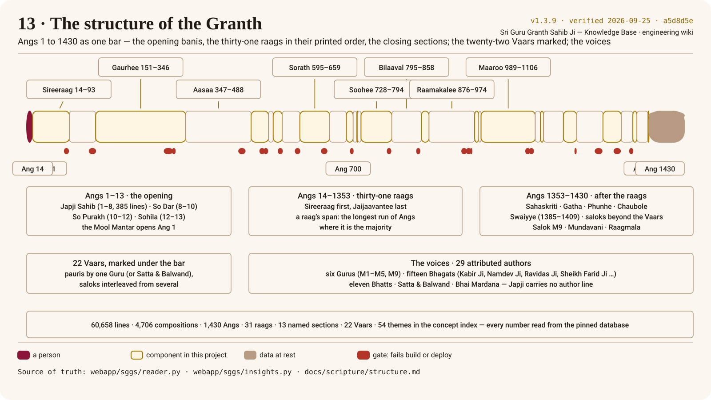

# The structure of the Granth

> **Explanation, not scripture — scholar review pending (gate G3).** These pages explain the
> scripture to engineers and students. Every quoted line is verbatim from the pinned database and
> cited by Ang; everything else is explanation, written by engineers and awaiting a Granthi's
> review. Where this page and the scripture differ, the scripture is right.

The Granth is one long, deliberately ordered text. Press *Next* on the poster to build it up; every
number on it is read from the pinned database, which the tables below list in full.



## Three parts

1. **The opening, Angs 1–13.** The [[Mool Mantar]] and [[Japji]] Sahib (385 lines,
   Angs 1–8), then So Dar, So Purakh and Sohila — the [[Sohila|evening and night prayers]].
   In the database these are the first four named sections; Japji's lines carry `author = null`
   because the print has no ਮਹਲਾ line for it.
2. **The raags, Angs 14–1353.** Thirty-one [[Raag|raags]], from `ਸਿਰੀਰਾਗੁ` on Ang 14 to `ਜੈਜਾਵੰਤੀ` on
   Ang 1353. Inside a raag the compositions run through the Gurus in order, then the Bhagats; the
   headings name the Guru as [[Mahalla]] (`ਮਹਲਾ ੧` to `੫`, and `੯`). A raag's *span* in the database
   is the longest run of Angs where it is the majority, so a liturgical mention of a raag elsewhere
   never drags its start.
3. **After the raags, Angs 1353–1430.** The [[Sahaskriti]] saloks, Gatha, Phunhe and Chaubole, the
   Bhatts' [[Swaiyye]], the saloks beyond the Vaars, Guru Tegh Bahadur Ji's
   saloks, [[Mundavani]] — the seal — and [[Raagmala]]. The database clears the raag column from
   Ang 1353 (`POST_RAAG_ANG`) and detects these sections from their headings.

## The named sections (13)

| Section | Angs | Lines |
|---|---|---|
| `ਜਪੁ` | 1–8 | 385 |
| `ਸੋ ਦਰੁ` | 8–10 | 84 |
| `ਸੋ ਪੁਰਖੁ` | 10–12 | 64 |
| `ਸੋਹਿਲਾ` | 12–13 | 56 |
| `ਸਲੋਕ ਸਹਸਕ੍ਰਿਤੀ` | 1353–1360 | 261 |
| `ਗਾਥਾ` | 1360–1361 | 61 |
| `ਫੁਨਹੇ` | 1361–1363 | 94 |
| `ਚਉਬੋਲੇ` | 1363–1384 | 815 |
| `ਸਵਈਏ` | 1385–1409 | 780 |
| `ਸਲੋਕ ਵਾਰਾਂ ਤੇ ਵਧੀਕ` | 1410–1426 | 601 |
| `ਸਲੋਕ ਮਹਲਾ ੯` | 1426–1429 | 117 |
| `ਮੁੰਦਾਵਣੀ` | 1429–1429 | 11 |
| `ਰਾਗ ਮਾਲਾ` | 1429–1430 | 62 |

## The raags (31)

| # | Raag | Roman | Angs | Compositions | Lines |
|---|---|---|---|---|---|
| 1 | `ਸਿਰੀਰਾਗੁ` | *sireeraag* | 14–93 | 208 | 3,163 |
| 2 | `ਮਾਝ` | *maajh* | 94–150 | 177 | 2,518 |
| 3 | `ਗਉੜੀ` | *gaurhee* | 151–346 | 740 | 9,628 |
| 4 | `ਆਸਾ` | *aasaa* | 347–488 | 448 | 6,203 |
| 5 | `ਗੂਜਰੀ` | *goojaree* | 489–526 | 194 | 1,467 |
| 6 | `ਦੇਵਗੰਧਾਰੀ` | *devagandhaaree* | 527–536 | 47 | 346 |
| 7 | `ਬਿਹਾਗੜਾ` | *bihaagarhaa* | 537–556 | 79 | 712 |
| 8 | `ਵਡਹੰਸੁ` | *vadahans* | 557–594 | 119 | 1,425 |
| 9 | `ਸੋਰਠਿ` | *sorath* | 595–659 | 243 | 2,643 |
| 10 | `ਧਨਾਸਰੀ` | *dhanaasaree* | 660–695 | 105 | 1,415 |
| 11 | `ਜੈਤਸਰੀ` | *jaitasaree* | 696–710 | 75 | 590 |
| 12 | `ਟੋਡੀ` | *todee* | 711–718 | 33 | 282 |
| 13 | `ਬੈਰਾੜੀ` | *bairaarhee* | 719–720 | 7 | 51 |
| 14 | `ਤਿਲੰਗ` | *tilang* | 721–727 | 19 | 275 |
| 15 | `ਸੂਹੀ` | *soohee* | 728–794 | 207 | 2,656 |
| 16 | `ਬਿਲਾਵਲੁ` | *bilaaval* | 795–858 | 230 | 2,615 |
| 17 | `ਗੋਂਡ` | *gond* | 859–875 | 49 | 834 |
| 18 | `ਰਾਮਕਲੀ` | *raamakalee* | 876–974 | 270 | 4,469 |
| 19 | `ਨਟ` | *nat* | 975–983 | 25 | 290 |
| 20 | `ਮਾਲੀ ਗਉੜਾ` | *maalee gaurhaa* | 984–988 | 15 | 201 |
| 21 | `ਮਾਰੂ` | *maaroo* | 989–1106 | 311 | 5,183 |
| 22 | `ਤੁਖਾਰੀ` | *tukhaaree* | 1107–1117 | 11 | 380 |
| 23 | `ਕੇਦਾਰਾ` | *kedaaraa* | 1118–1124 | 20 | 227 |
| 24 | `ਭੈਰਉ` | *bhairau* | 1125–1167 | 105 | 2,133 |
| 25 | `ਬਸੰਤੁ` | *basant* | 1168–1196 | 81 | 1,449 |
| 26 | `ਸਾਰੰਗ` | *saarang* | 1197–1253 | 282 | 2,207 |
| 27 | `ਮਲਾਰ` | *malaar* | 1254–1293 | 161 | 1,633 |
| 28 | `ਕਾਨੜਾ` | *kaanarhaa* | 1294–1318 | 115 | 906 |
| 29 | `ਕਲਿਆਨੁ` | *kaliaan* | 1319–1327 | 24 | 280 |
| 30 | `ਪ੍ਰਭਾਤੀ` | *prabhaatee* | 1328–1351 | 65 | 1,046 |
| 31 | `ਜੈਜਾਵੰਤੀ` | *jaijaavantee* | 1352–1353 | 4 | 33 |

## The voices (29 attributed authors)

Six Gurus, fifteen [[Bhagat|Bhagats]], eleven [[Bhatt|Bhatts]] (plus the generic Bhatt
attribution where a Swaiyya's signature names no single bard), Satta and Balwand, and Bhai
Mardana. Japji's 385 lines are unattributed in the print.

| Author | Angs | Lines |
|---|---|---|
| Guru Arjan Dev Ji (M5) | 10–1430 | 25,285 |
| Guru Nanak Dev Ji (M1) | 8–1412 | 11,792 |
| Guru Amar Das Ji (M3) | 26–1421 | 10,170 |
| Guru Ram Das Ji (M4) | 10–1424 | 6,612 |
| Bhagat Kabir Ji | 91–1375 | 3,284 |
| Bhagat Namdev Ji | 345–1351 | 680 |
| Guru Tegh Bahadur Ji (M9) | 219–1429 | 614 |
| Bhagat Ravidas Ji | 345–1293 | 473 |
| Guru Angad Dev Ji (M2) | 83–1290 | 294 |
| Bhatt Kalsahar (ਭਟ) | 1389–1408 | 279 |
| Bhagat Beni Ji | 93–1351 | 99 |
| Satta & Balwand | 966–968 | 91 |
| Sheikh Farid Ji | 488–1378 | 90 |
| Bhatt Nal (ਭਟ) | 1398–1401 | 84 |
| Bhagat Trilochan Ji | 525–695 | 70 |
| Bhatt Mathura (ਭਟ) | 1404–1409 | 69 |
| The Bhatts (ਭਟ) | 1389–1410 | 54 |
| Bhatt Kirat (ਭਟ) | 1395–1406 | 40 |
| Bhatt Gayand (ਭਟ) | 1402–1404 | 38 |
| Bhatt Bal (ਭਟ) | 1405–1405 | 26 |
| Bhatt Jalap (ਭਟ) | 1394–1395 | 25 |
| Bhatt Sal (ਭਟ) | 1396–1406 | 18 |
| Bhagat Bhikhan Ji | 659–659 | 16 |
| Bhagat Ramanand Ji | 1195–1195 | 16 |
| Bhagat Jaidev Ji | 526–526 | 15 |
| Bhai Mardana | 553–553 | 15 |
| Bhatt Bhikha (ਭਟ) | 1395–1396 | 13 |
| Bhatt Haribans (ਭਟ) | 1409–1409 | 7 |
| Bhatt Bhal (ਭਟ) | 1396–1396 | 4 |

## The numbers, from the database

| | |
|---|---|
| Line records | 60,658 |
| Compositions (`comp_id`) | 4,527 distinct, `max(comp_id)` 5,376 — the gaps are permanent |
| Heading lines | 5,147 |
| Rahao lines | 2,676 |
| Lines carrying ੴ | 568 (the health check requires at least 560) |
| Raags · sections · Vaars · themes | 31 · 13 · 22 · 54 |

## Check yourself

<!-- sggs:quiz -->
```quiz
Q: Which Ang does the first raag begin on?
- Ang 14 ✓ — after Japji Sahib, So Dar, So Purakh and Sohila
- Ang 1 — Ang 1 opens with the Mool Mantar and Japji, which are not in a raag
- Ang 1353 — that is where the last raag ends and the closing sections begin
Q: Why does the database clear the raag column from Ang 1353?
- Because the Granth leaves the raag framework there ✓ — the closing sections are detected from their headings instead
- Because the source PDF is missing those pages — every one of the 1,430 Angs is present, gap-free
- Because those Angs have no headings — they have headings; they are simply not raag headings
Q: How is a raag's span computed?
- The longest run of Angs where the raag is the majority ✓ — so a liturgical mention elsewhere cannot drag its start
- Every Ang where the raag's name appears — that would make spans overlap
- The Angs listed in Raagmala — Raagmala is an index of raags, not of pages
```
Read next: [Vaars, saloks and pauris](vaars-saloks-pauris.md).
