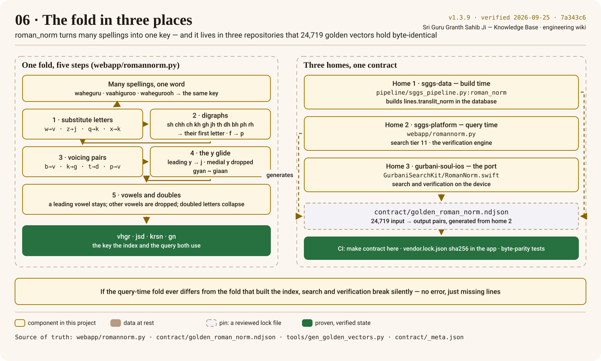

# The Roman fold

Seekers spell a Gurmukhi word in Roman letters the way they hear it. The fold makes every spelling
of a word land on one key — and it must be exactly the same fold wherever it runs, or the key the
query produces will not match the key in the index and lines go missing without any error.

## The function, read from the source

<!-- sggs:code file="webapp/romannorm.py" symbol="roman_norm" -->
Source: [`webapp/romannorm.py`](../../webapp/romannorm.py), the platform's one copy of the fold.

In words, for each lower-cased word:

1. **Substitute letters** — `w→v`, `z→j`, `q→k`, `x→k`.
2. **Reduce digraphs** — `sh`, `chh`, `ch`, `kh`, `gh`, `jh`, `th`, `dh`, `bh`, `ph`, `rh` become
   their first letter; `f` becomes `p`.
3. **Merge voicing pairs** — `b→v`, `k→g`, `t→d`, `p→v` (`ਬ`/`ਵ`, and Sanskrit↔Punjabi voicing:
   *bhakti* ~ *bhagatee*).
4. **The y glide** — a leading `y` becomes `j`; a medial `y` is dropped (*gyan* ~ *giaan*).
5. **Vowels and doubles** — a leading vowel is kept, every other vowel is dropped, doubled letters
   collapse.

So `waheguru`, `vaahiguroo` → `vhgr`; `yashoda`, `jasodaa` → `jsd`; `krishna`, `krisan` → `krsn`;
`gyan`, `giaan` → `gn`. The fold is lossy on purpose: it trades precision for recall, which is why
the [waterfall](../architecture/search-waterfall.md) tries it only after the exact tiers, and why
the verification engine uses it to *find candidates*, never to decide a verdict on its own.

## Three homes

| Where | File | When it runs |
|---|---|---|
| sggs-data | `pipeline/sggs_pipeline.py:roman_norm` | at build time, writing `lines.translit_norm` |
| sggs-platform | `webapp/romannorm.py` (re-exported by `serve.py`, imported by `verify.py`) | at query time: search tier 11, the verification engine |
| gurbani-soul-ios | `GurbaniSearchKit/Sources/GurbaniSearchKit/RomanNorm.swift` | on the device: search and verification |

`verify.py` cannot import `serve.py` (serve imports verify), which is why the fold lives in its
own module; there is exactly one copy in this repository.

## One contract

`tools/gen_golden_vectors.py` drives the platform's function over a corpus-wide vocabulary and
records **24,719 input → output pairs** in `contract/golden_roman_norm.ndjson`. `make contract`
regenerates the vectors and fails if the committed file drifts; the app pins the file by sha256 in
its `vendor.lock.json` and runs byte-parity tests against the Swift port; the data repository's copy
is held to the same vectors. Change one character of the fold and three test suites fail before
any index goes stale. How the contract is generated and replayed is on
[Harnesses and golden vectors](harnesses-and-golden-vectors.md).

## What the fold is not

- **Not scripture, not a transliteration.** `translit` is the reading aid; `translit_norm` is an
  index key that is never shown to a reader.
- **Not applied to Gurmukhi.** A Gurmukhi query goes to the text and skeleton columns; the fold
  exists for Roman input only.
- **Not a place for clever fixes.** A "small improvement" to the fold changes the key of every
  line in the corpus: rebuild the database, regenerate the contract, re-vendor the app.
