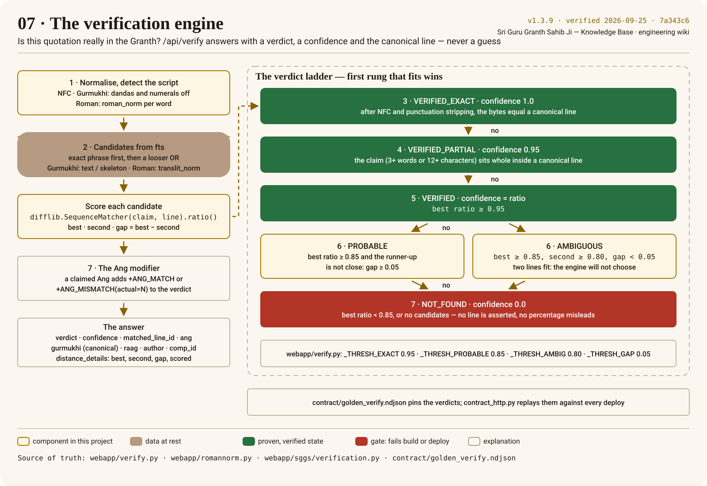

# Verification engine

`/api/verify?q=&ang=` answers one question: *is this quotation really in Sri Guru Granth Sahib Ji,
and where?* It returns a **verdict**, a **confidence**, the **canonical line** with its [[Ang]], and the
scoring details. It never returns a line it is not sure about: below the thresholds the verdict
is `NOT_FOUND` and no line is asserted. The engine is `webapp/verify.py`, stdlib only, importable
and served by the `verify` bounded context.



## Try it

<!-- sggs:verify -->
On the rendered wiki this is a playground: paste a quotation ([[Gurmukhi]], or romanised), optionally
the Ang you believe it is on, and the verdict, the canonical line and the scoring details come back
from the live API while the rung lights up on the poster. On GitHub, open
[this page on the wiki](https://docs.gurbanisoul.com/search/verification-engine/) to use it, or call
`GET /api/verify?q=…&ang=…` on the production API yourself ([the API](../api/README.md)).

## The ladder

The thresholds are module constants in `webapp/verify.py`; `tools/docs_check.py` fails the build
if the numbers on the poster stop matching them.

| Rung | Verdict | Condition | Confidence |
|---|---|---|---|
| 1 | — | NFC-normalise; detect the script. Gurmukhi: strip dandas, danda numerals, pipes. Roman: fold each word with `roman_norm` | — |
| 2 | — | candidates from `fts`: an exact phrase (text / skeleton for Gurmukhi, `translit_norm` for Roman), then a looser OR; each scored with `difflib.SequenceMatcher(...).ratio()` | — |
| 3 | `VERIFIED_EXACT` | the phrase query produced an exact hit (the cleaned bytes equal a line) | 1.0 |
| 4 | `VERIFIED_PARTIAL` | the claim (≥ 3 words or ≥ 12 characters) sits whole inside a candidate line, and is not the whole line | 0.95 |
| 5 | `VERIFIED` | best ratio ≥ **0.95** (`_THRESH_EXACT`) | the ratio |
| 6 | `PROBABLE` | best ratio ≥ **0.85** (`_THRESH_PROBABLE`) and the runner-up is not close | the ratio |
| 6 | `AMBIGUOUS` | best ≥ 0.85, runner-up ≥ **0.80** (`_THRESH_AMBIG`), gap < **0.05** (`_THRESH_GAP`): two lines fit | the ratio |
| 7 | `NOT_FOUND` | best ratio < 0.85, or no candidates | 0.0 — no line asserted |

**The Ang modifier.** When the caller claims an Ang and a line was matched, the verdict gains
`+ANG_MATCH` or `+ANG_MISMATCH(actual=N)`. A mismatch is still a found line — the quotation exists,
just not where the caller said.

<!-- sggs:code file="webapp/verify.py" symbol="_make_verdict" -->
Source: [`webapp/verify.py` · `_make_verdict`](../../webapp/verify.py) — the ladder, read from the file at build time.

## The response

```json
{
  "verdict": "VERIFIED+ANG_MISMATCH(actual=1)",
  "confidence": 1.0,
  "matched_line_id": 5,
  "ang": 1, "gurmukhi": "…the canonical line, verbatim…",
  "raag": null, "author": null, "comp_id": 2, "section": "…",
  "distance_details": { "best_ratio": 1.0, "second_ratio": 0.0, "gap": 1.0, "candidates_scored": 1 }
}
```

`gurmukhi` is always the **canonical** line from the database, never the caller's text echoed
back; `comp_id` lets a client open the whole composition. `distance_details` is diagnostic: for a
`NOT_FOUND` it says why (`no FTS hits`, or the ratios that fell short).

## Input handling

- The claim is limited (`MAX_CLAIM_CHARS` in `webapp/sggs/verification.py`); an empty claim is
  HTTP 400.
- FTS tokens are sanitised and quoted with a central empty-`MATCH` guard: a crafted quote or
  asterisk cannot break the query or leak an exception (hardened in v2.11.0).
- The engine opens the database read-only and immutable, with `query_only` as a second fence —
  the same guarantees as the API's own connection factory.

## Pinned by the contract

`contract/golden_verify.ndjson` records real claims and their full verdicts. `make contract` fails
if the engine's behaviour drifts; `tools/contract_http.py` replays the same records over HTTP
against every deploy and the iOS app asserts its Swift port against the same file. See
[Harnesses and golden vectors](harnesses-and-golden-vectors.md).
